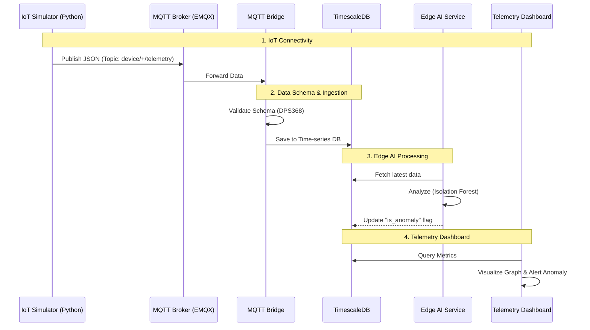

# Edge AI Device Simulator Architecture

## Overview

This example demonstrates an end-to-end IoT telemetry flow, simulating an IoT device that sends sensor data through an MQTT broker to an Edge AI system for anomaly detection and visualization on a dashboard.

## System Architecture

```
┌─────────────────────────────────────────────────────────────────────────────────┐
│                           End-to-End IoT Flow                                   │
│                                                                                 │
│  ┌─────────────────┐    ┌─────────────────┐    ┌─────────────────┐              │
│  │  IoT Simulator  │    │   MQTT Broker   │    │  MQTT Bridge    │              │
│  │  (This Example) │───▶│  (EMQX/Mosquitto│───▶│  (Rule Engine)  │              │
│  │                 │    │  Port: 1883)    │    │                 │              │
│  └─────────────────┘    └─────────────────┘    └────────┬────────┘              │
│                                                         │                        │
│                                                         ▼                        │
│                                               ┌─────────────────┐                │
│                                               │  TimescaleDB    │                │
│                                               │  (Time-series)  │                │
│                                               └────────┬────────┘                │
│                                                        │                         │
│                              ┌─────────────────────────┼─────────────────┐       │
│                              │                         │                 │       │
│                              ▼                         ▼                 ▼       │
│                    ┌─────────────────┐      ┌─────────────────┐  ┌────────────┐  │
│                    │  Edge AI        │      │  Telemetry      │  │  Alert     │  │
│                    │  (Anomaly Det.) │      │  Dashboard      │  │  Service   │  │
│                    └─────────────────┘      └─────────────────┘  └────────────┘  │
│                                                                                  │
└──────────────────────────────────────────────────────────────────────────────────┘
```

## Data Flow Sequence



## Component Description

### 1. IoT Connectivity (Device Simulator)

| Attribute      | Description                                        |
| -------------- | -------------------------------------------------- |
| **Role**       | Virtual Sensor / IoT Device Simulator              |
| **Technology** | Python with paho-mqtt library                      |
| **Protocol**   | MQTT v3.1.1 over TCP/IP                            |
| **Function**   | Generate and publish sensor data at 1 Hz frequency |

**Responsibilities:**

- Connect to MQTT broker with auto-reconnect capability
- Generate realistic sensor data (pressure, temperature)
- Inject anomalous values for Edge AI testing
- Publish JSON payloads to configured topic

### 2. Data Schema (Information Model)

| Attribute    | Description                             |
| ------------ | --------------------------------------- |
| **Model**    | Infineon XENSIV™ DPS368 Sensor          |
| **Standard** | JSON format with ISO-8601 timestamps    |
| **Fields**   | timestamp, device_id, sensor_type, data |

**Schema Definition:**

```json
{
  "timestamp": "<ISO-8601>",
  "device_id": "infineon-sensor-01",
  "sensor_type": "DPS368",
  "data": {
    "pressure": 1013.25,
    "temperature": 25.43
  }
}
```

### 3. Edge AI (Intelligence Layer)

| Attribute     | Description                             |
| ------------- | --------------------------------------- |
| **Role**      | Anomaly Detection Service               |
| **Algorithm** | Isolation Forest / Statistical Analysis |
| **Input**     | Real-time sensor data from database     |
| **Output**    | is_anomaly flag updated in database     |

**Testing Strategy:**

- Device injects known anomalies (e.g., Temperature > 80°C)
- AI service should detect and flag these anomalies
- Dashboard highlights anomalous data points

### 4. Telemetry Dashboard (Visualization)

| Attribute      | Description                                      |
| -------------- | ------------------------------------------------ |
| **Role**       | Real-time data visualization                     |
| **Technology** | Grafana / React Dashboard                        |
| **Features**   | Time-series graphs, anomaly highlighting, alerts |

## Topic Structure

```
device/
├── infineon-sensor-01/
│   └── telemetry          # Sensor readings
├── <device_id>/
│   └── telemetry          # Other devices
└── +/
    └── telemetry          # Wildcard subscription
```

## Message Flow

```
┌──────────────────────────────────────────────────────────────────┐
│                      Message Lifecycle                           │
├──────────────────────────────────────────────────────────────────┤
│                                                                  │
│  1. GENERATE                                                     │
│  ┌────────────────────────────────────────────────────────────┐  │
│  │  InfineonDPS368Simulator._generate_telemetry()             │  │
│  │  → Random pressure: 950-1050 hPa                           │  │
│  │  → Random temperature: 20-35 °C                            │  │
│  │  → Every 10th: Anomaly injection (>80°C or >1200 hPa)      │  │
│  └────────────────────────────────────────────────────────────┘  │
│                              │                                   │
│                              ▼                                   │
│  2. SERIALIZE                                                    │
│  ┌────────────────────────────────────────────────────────────┐  │
│  │  json.dumps(payload)                                       │  │
│  │  → ISO-8601 timestamp                                      │  │
│  │  → Device metadata                                         │  │
│  │  → Sensor readings                                         │  │
│  └────────────────────────────────────────────────────────────┘  │
│                              │                                   │
│                              ▼                                   │
│  3. PUBLISH                                                      │
│  ┌────────────────────────────────────────────────────────────┐  │
│  │  client.publish(topic, payload, qos=1)                     │  │
│  │  → Topic: device/infineon-sensor-01/telemetry              │  │
│  │  → QoS 1: At least once delivery                           │  │
│  └────────────────────────────────────────────────────────────┘  │
│                              │                                   │
│                              ▼                                   │
│  4. BROKER                                                       │
│  ┌────────────────────────────────────────────────────────────┐  │
│  │  EMQX/Mosquitto processes message                          │  │
│  │  → Route to subscribers                                    │  │
│  │  → Forward to bridge/rule engine                           │  │
│  └────────────────────────────────────────────────────────────┘  │
│                                                                  │
└──────────────────────────────────────────────────────────────────┘
```

## Anomaly Injection Strategy

```
┌─────────────────────────────────────────────────────────────┐
│                   Anomaly Injection Logic                   │
├─────────────────────────────────────────────────────────────┤
│                                                             │
│  packet_count = 0                                           │
│                                                             │
│  while running:                                             │
│      packet_count += 1                                      │
│                                                             │
│      if packet_count % 10 == 0:      # Every 10th packet    │
│          │                                                  │
│          ├─── [Random Choice] ───┐                          │
│          │                       │                          │
│          ▼                       ▼                          │
│    ┌──────────┐          ┌──────────┐         ┌──────────┐  │
│    │Temp Only │          │Press Only│         │   Both   │  │
│    │  >80°C   │          │ >1200hPa │         │   Both   │  │
│    └──────────┘          └──────────┘         └──────────┘  │
│                                                             │
│      else:                          # Normal packets        │
│          ▼                                                  │
│    ┌──────────────────────────────────────────┐             │
│    │  Normal Range Data                        │             │
│    │  Pressure: 950-1050 hPa                   │             │
│    │  Temperature: 20-35 °C                    │             │
│    └──────────────────────────────────────────┘             │
│                                                             │
└─────────────────────────────────────────────────────────────┘
```

## Connection Management

```
┌──────────────────────────────────────────────────────────────┐
│                   Connection State Machine                   │
├──────────────────────────────────────────────────────────────┤
│                                                              │
│            ┌──────────────┐                                  │
│            │   INITIAL    │                                  │
│            └──────┬───────┘                                  │
│                   │ connect()                                │
│                   ▼                                          │
│            ┌──────────────┐                                  │
│     ┌─────▶│  CONNECTING  │                                  │
│     │      └──────┬───────┘                                  │
│     │             │                                          │
│     │      ┌──────┴──────┐                                   │
│     │      │             │                                   │
│     │      ▼             ▼                                   │
│     │   Success       Failure                                │
│     │      │             │                                   │
│     │      ▼             │                                   │
│     │ ┌──────────┐       │                                   │
│     │ │CONNECTED │       │                                   │
│     │ │          │       │                                   │
│     │ │ publish()│       │                                   │
│     │ └────┬─────┘       │                                   │
│     │      │             │                                   │
│     │   disconnect       │                                   │
│     │      │             │                                   │
│     │      ▼             │                                   │
│     │ ┌──────────────┐   │                                   │
│     └─│ DISCONNECTED │◀──┘                                   │
│       │              │                                       │
│       │ reconnect    │                                       │
│       │ (1-30s delay)│                                       │
│       └──────────────┘                                       │
│                                                              │
└──────────────────────────────────────────────────────────────┘
```

## Key Design Decisions

| Decision            | Rationale                                          |
| ------------------- | -------------------------------------------------- |
| paho-mqtt library   | Industry standard, well-documented, cross-platform |
| QoS 1               | Balance between reliability and performance        |
| JSON payload        | Human readable, widely supported, easy to parse    |
| ISO-8601 timestamps | Standard format, timezone-aware                    |
| Environment config  | Flexible deployment, 12-factor app compliance      |
| Auto-reconnect      | Resilient to network interruptions                 |
| Periodic anomalies  | Predictable testing of Edge AI detection           |

## Integration Points

```
This Example                    Integration Target
─────────────────────────────────────────────────────────
device/+/telemetry     ───────▶  WSS Live Streaming
                                 (Subscribe for real-time)

JSON Payload           ───────▶  MQTT Bridge / Rule Engine
                                 (Parse and route)

Anomaly Values         ───────▶  Edge AI Service
                                 (Detection testing)

Time-series Data       ───────▶  Grafana Dashboard
                                 (Visualization)
```

## Testing

### Unit Testing

```bash
# Test data generation
python -c "from main import InfineonDPS368Simulator; s = InfineonDPS368Simulator(); print(s._generate_telemetry())"
```

### Integration Testing

```bash
# Terminal 1: Start broker
docker run --rm -p 1883:1883 eclipse-mosquitto:2 mosquitto -c /mosquitto-no-auth.conf

# Terminal 2: Subscribe
mosquitto_sub -h localhost -t "device/+/telemetry" -v

# Terminal 3: Run simulator
python main.py
```

## Performance Considerations

| Metric            | Value          | Notes                             |
| ----------------- | -------------- | --------------------------------- |
| Publish Rate      | 1 msg/sec      | Configurable via PUBLISH_INTERVAL |
| Payload Size      | ~150 bytes     | JSON with minimal data            |
| Memory Usage      | ~20 MB         | Python runtime + paho-mqtt        |
| CPU Usage         | < 1%           | Minimal processing overhead       |
| Network Bandwidth | ~150 bytes/sec | Without MQTT overhead             |
