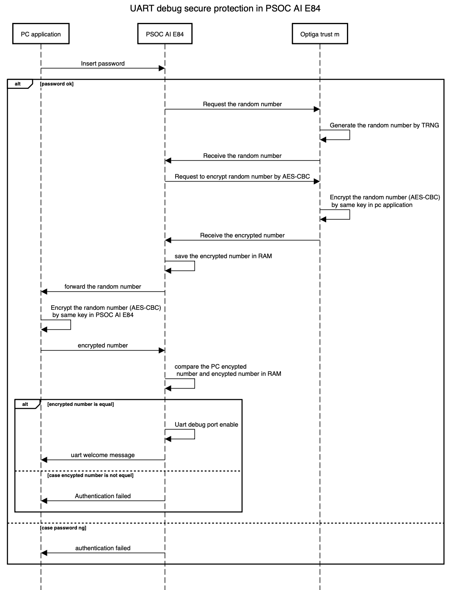
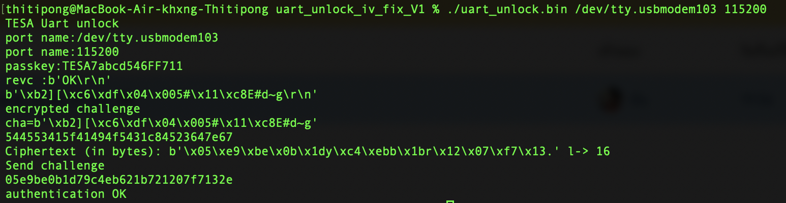
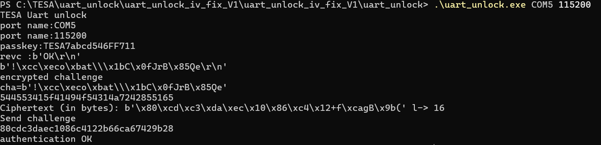

## UART Secure design
This application helps protect against unauthorized debug access that could lead to data
hacking. Production software should only be accessible by authorized personnel.
Furthermore, the application leverages the Optiga™ Trust M hardware accelerator to
enhance security operations. The overall application flow is described as follows.





## First environment setup
Download source code for develop hub.

```c
 git clone https://github.com/tesaiot/developer-hub.git -b uart_secure
 cd examples/uart_secure
 ./apply_patches.sh

```
If the board is new, the UART key will not be updated automatically. You must update the key by modifying the code in the proj_cm33_ns folder.

Change the parameter to PROTECTED_UPDATE in order to update the key.
```c
 crypt_authen_key_test(PROTECT_UPDATED);
```

After program and run completely 

Change the parameter back to RUNTIME to switch to runtime mode.
```c
crypt_authen_key_test(RUNTIME);

```
and program again 

## Unlock UART with PC application

In the demo firmware, a secure challenge–response mechanism is implemented. After the password is entered, a secure handshake is performed between the PC and the PSoC E84 using OPTIGA Trust. Once the handshake is successfully completed, the UART debug session is enabled.

[Download the UART UNLOCK from link](https://drive.google.com/file/d/1fhgSAcZ8EGK54jHMijGjPxxdUWiwBEIA/view?usp=share_link)

Mac osx 

Run the command line with variables depending on the speed and UART port name

```
./uart_unlock.bin /dev/tty.usbmodem103 115200
```


Window os


```
.\uart_unlock.exe COM5 115200

```




