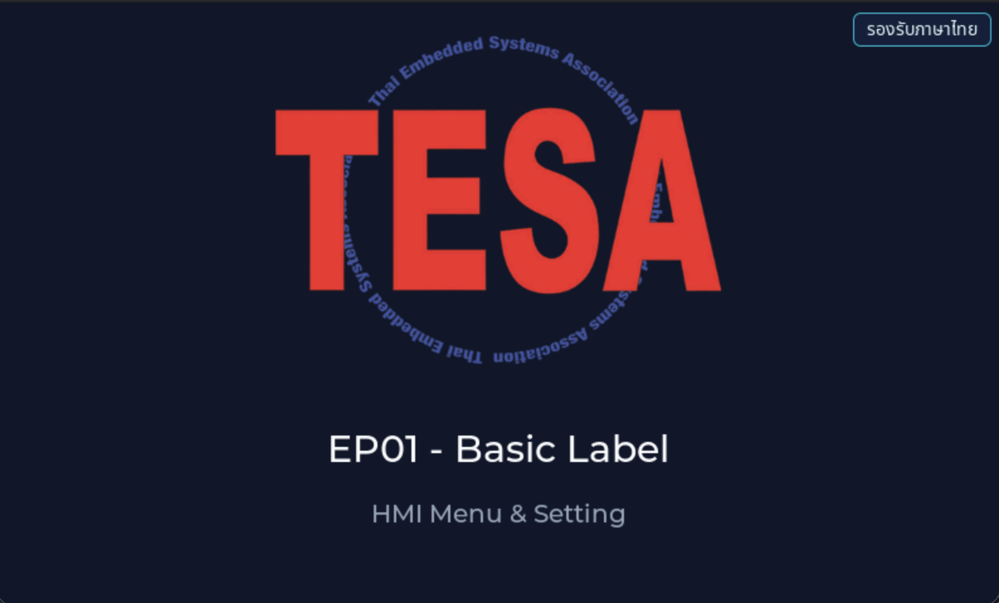

# EP01 — Basic Label (ตัวอย่างแรก: ป้ายต้อนรับ)

> **Series:** HMI Menu & Setting • **Episode:** 1 / 7 • **ระดับ:** beginner

## Screenshot



## Why — ทำไมต้องเรียนตัวอย่างนี้?

ทุกคนที่เขียน GUI บน embedded board ต้องเริ่มจาก "ทำยังไงให้มีอะไรโผล่ขึ้นบนหน้าจอ"
เพราะถ้าขั้นแรกนี้ไม่ได้ ขั้นต่อไปทั้งหมด (ปุ่ม, เมนู, WiFi list) ก็ไม่มีทางเกิดขึ้น

EP01 เป็นตัวอย่างที่ "เล็กที่สุดเท่าที่จะแสดงผลได้จริง" — วาดโลโก้ของ TESAIoT
พร้อมข้อความหัวเรื่องกับคำบรรยายสั้น ๆ บนหน้าจอเปล่า ๆ ของ LVGL เท่านั้น
ไม่มี event, ไม่มี task, ไม่มีข้อมูลจาก sensor

หลังเรียนจบคุณจะเข้าใจ:

- ทำไม master template เรียก `example_main(lv_scr_act())` ให้เราแทนที่จะให้เราเขียน `main` เอง
- โครงสร้าง LVGL object tree แบบพื้นฐาน: `screen → image → label`
- วิธีตั้งสีพื้นหลัง, font, การจัดวางแบบ align กับ parent
- ทำไมต้องฝัง image เป็น C array (`APP_LOGO`) แทนที่จะโหลดจาก file system

นี่เป็นฐานราก — ep02 ถึง ep07 สร้างอยู่บนสิ่งที่ ep01 สอนทั้งหมด

## What — ตัวอย่างนี้แสดงอะไร?

เมื่อบอร์ด boot แล้ว master template จะ init ทุกอย่างให้เสร็จ (FreeRTOS, display driver,
VGLite GPU, LVGL) จากนั้นเรียก `example_main()` ครั้งเดียว เราจะ forward ไปที่
`ui_ep01_basic_label_create()` ซึ่งสร้างสิ่งต่อไปนี้บน `lv_screen_active()`:

- **พื้นหลัง** สีน้ำเงินเข้ม `#0F172A` (slate-900 จาก Tailwind palette)
- **โลโก้ TESAIoT** วาดจาก `&APP_LOGO` ซึ่งเป็น `lv_image_dsc_t` ที่อยู่ใน `app_logo.c`
  จัดวางที่ `LV_ALIGN_TOP_MID` (ขอบบนตรงกลาง) เยื้องลง 24 px
- **Title label** ข้อความ "EP01 - Basic Label" ฟอนต์ `lv_font_montserrat_30`
  สีขาวอมฟ้า `#F8FAFC` อยู่ใต้โลโก้ 48 px
- **Subtitle label** ข้อความ "HMI Menu & Setting" ฟอนต์ `lv_font_montserrat_20`
  สีเทา `#94A3B8` อยู่ใต้ title 24 px

หน้าจอเป็น static ล้วน ๆ — ไม่มี touch interaction, ไม่มี animation, ไม่มีการ refresh
ข้อมูล วาดครั้งเดียวจบ แล้ว LVGL event loop ก็แค่ redraw frame ให้เรื่อย ๆ

### ไฟล์ที่มีใน episode นี้

| File | บทบาท |
| --- | --- |
| `main_example.c` | implement `example_main(parent)` ที่ master เรียก — forward ไปที่ `ui_ep01_basic_label_create()` |
| `ui_ep01_basic_label.c` / `.h` | สร้าง label/logo บน active screen — ตรรกะทั้งหมดของ episode |
| `app_logo.c` / `.h` | `lv_image_dsc_t APP_LOGO` — pixel data ของโลโก้แบบ embed ใน flash |
| `APP_LOGO.png` | ต้นฉบับ PNG (ไว้ reference — ไม่ถูก compile เข้า firmware) |

## How — ทำงานอย่างไร?

### ขั้นที่ 1: Master template เรียก `example_main(parent)`

ใน `tesaiot_dev_kit_master/proj_cm55/main.c` task `cm55_gfx_task()` จะทำ:

```
cybsp_init() → display panel init → vg_lite_init() →
lv_init() → lv_port_disp_init() → lv_port_indev_init() →
example_main(lv_scr_act());          ← จุดที่ master ส่ง control ให้เรา
```

หลังจากจุดนี้ master จะวน `lv_timer_handler()` ให้ตลอดไป เราแค่เตรียม UI tree ไว้

### ขั้นที่ 2: `main_example.c` forward ไปที่ entry function

```c
void example_main(lv_obj_t *parent)
{
    (void)parent;
    ui_ep01_basic_label_create();
}
```

ตัวแปร `parent` ที่ master ส่งมาคือ `lv_scr_act()` — active screen ปัจจุบัน
เราไม่ได้ใช้มันตรง ๆ เพราะ `ui_ep01_basic_label_create()` เรียก `lv_screen_active()`
ภายในตัวเอง (เพื่อให้ episode เดิม copy มาใช้ได้โดยไม่ต้องแก้)

### ขั้นที่ 3: `ui_ep01_basic_label_create()` สร้าง widget tree

ดู `ui_ep01_basic_label.c`:

```c
lv_obj_t *screen = lv_screen_active();
lv_obj_set_style_bg_color(screen, lv_color_hex(0x0F172A), LV_PART_MAIN);
lv_obj_set_style_bg_opa(screen, LV_OPA_COVER, LV_PART_MAIN);

lv_obj_t *logo = lv_image_create(screen);
lv_image_set_src(logo, &APP_LOGO);
lv_obj_align(logo, LV_ALIGN_TOP_MID, 0, 24);

lv_obj_t *title = lv_label_create(screen);
lv_label_set_text(title, "EP01 - Basic Label");
lv_obj_set_style_text_font(title, &lv_font_montserrat_30, LV_PART_MAIN);
lv_obj_align_to(title, logo, LV_ALIGN_OUT_BOTTOM_MID, 0, 48);
```

สังเกต API ที่สำคัญ:

- `lv_image_create(parent)` — สร้าง image widget โดยมี parent เป็น screen
- `lv_image_set_src(img, &APP_LOGO)` — ชี้ source เป็น pointer ไปที่ `lv_image_dsc_t`
  ที่เราฝังไว้ในโปรแกรม (ไม่ใช่ไฟล์บน SD card)
- `lv_obj_align()` — จัดวางเทียบกับ parent ของมัน
- `lv_obj_align_to(a, b, ...)` — จัดวาง `a` เทียบกับ `b` (ใช้ตำแหน่งของ b เป็น anchor)

### ขั้นที่ 4: LVGL event loop วาดให้เรื่อย ๆ

หลัง `example_main()` return แล้ว master ก็วน:

```
while (1) {
    lv_timer_handler();   // LVGL ตรวจ dirty region, flush เข้า display
    vTaskDelay(...);
}
```

ไม่ต้องทำอะไรเพิ่มเพราะไม่มี event — หน้าจอจะค้างภาพนั้นไปจนกว่าจะ reset

## วิธีติดตั้งและรัน

```sh
# 1. เข้าไปใน master project
cd tesaiot_dev_kit_master

# 2. ลบ episode เก่าใน apps/ (เก็บ app_interface.h / _default / README.md ไว้)
find proj_cm55/apps -mindepth 1 -maxdepth 1 \
     ! -name 'app_interface.h' ! -name 'README.md' ! -name '_default' \
     -exec rm -rf {} +

# 3. Copy episode files เข้า apps/
rsync -a ../episodes/hmi_ep01_basic_label/ proj_cm55/apps/

# 4. Build & flash
make clean
make program TARGET=APP_KIT_PSE84_AI CONFIG_DISPLAY=WS7P0DSI_RPI_DISP
```

## สิ่งที่จะเห็นบนหน้าจอ

- พื้นหลังน้ำเงินเข้มเต็มจอ
- โลโก้ TESAIoT กลางจอด้านบน
- ข้อความ "EP01 - Basic Label" (ตัวอักษรใหญ่ สีขาว) ใต้โลโก้
- ข้อความ "HMI Menu & Setting" (ตัวเล็ก สีเทา) ใต้ title
- ไม่มีอะไรขยับ — ภาพคงที่

## อะไรที่คุณสามารถทดลองเปลี่ยนได้?

1. **เปลี่ยนข้อความ** — แก้ `lv_label_set_text(title, "...")` เป็นชื่อคุณเอง
2. **เปลี่ยนสีพื้นหลัง** — เปลี่ยน `0x0F172A` เป็น hex color อื่น เช่น `0x1E293B` (เทาน้ำเงิน)
3. **เปลี่ยนฟอนต์** — ลอง `lv_font_montserrat_48` (ต้องเปิด config ใน `lv_conf.h`)
4. **ย้ายตำแหน่งโลโก้** — เปลี่ยน `LV_ALIGN_TOP_MID` เป็น `LV_ALIGN_CENTER`
5. **เพิ่ม label ใบที่สาม** — copy block ของ subtitle แล้วแก้ข้อความและ align

## ศัพท์ที่ต้องรู้

- **LVGL (Light and Versatile Graphics Library)** — graphics library สำหรับ embedded UI
- **`lv_obj_t`** — struct ของทุก widget ใน LVGL (button, label, image ล้วน ๆ เป็น `lv_obj_t *`)
- **`lv_scr_act()` / `lv_screen_active()`** — return screen object ที่ active อยู่ปัจจุบัน
- **`LV_PART_MAIN`** — ส่วนหลัก ๆ ของ widget (ใช้ตอน set style)
- **`lv_image_dsc_t`** — struct ที่เก็บ pixel data + header ของรูปภาพที่ฝังใน flash
- **`LV_ALIGN_TOP_MID`** — align constant หมายถึง "ขอบบน กลาง"
- **`lv_font_montserrat_30`** — ฟอนต์ Montserrat ขนาด 30 px (ต้องถูกเปิดใน `lv_conf.h`)
- **`lv_color_hex(0xXXXXXX)`** — แปลง hex literal เป็น `lv_color_t`

## ขั้นต่อไป

หลังจากเข้าใจ ep01 แล้ว ลองต่อด้วย **EP02 — Button Event** ที่จะสอนการสร้างปุ่มที่กดได้
และรับ `LV_EVENT_PRESSED` ผ่าน callback เพื่อเปลี่ยน counter value บนหน้าจอแบบ real time
