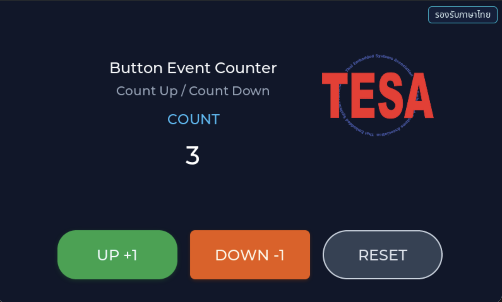

# EP02 — Button Event (ปุ่มกดที่ตอบสนองได้จริง)

> **Series:** HMI Menu & Setting • **Episode:** 2 / 7 • **ระดับ:** beginner

## Screenshot



## Why — ทำไมต้องเรียนตัวอย่างนี้?

ในโลกจริง UI ที่ไม่ตอบสนอง input ก็ไม่ต่างจากภาพ wallpaper หลัง ep01 เรามีหน้าจอ
static ที่วาดได้ แต่ยังไม่มี interaction กับผู้ใช้ ep02 เพิ่มสิ่งที่สำคัญที่สุดใน GUI
embedded คือ **event-driven programming** — เขียน callback ที่ LVGL จะเรียกเมื่อมี
touch event เกิดขึ้น

ที่สำคัญกว่านั้น ep02 ยังสอน pattern ที่ดี: **แยก UI ออกจาก logic** ไฟล์ `ui_button_counter.c`
ดูแลการวาดปุ่มและจัดวาง ส่วน `counter_logic.c` ดูแล state ของตัวเลขและอัปเดต label
นี่เป็นรูปแบบที่ใช้กันในโปรเจ็กต์จริงทุกที่ เพราะทำให้เปลี่ยน UI ได้โดยไม่ต้องแก้ logic
และกลับกัน

หลังจบ episode นี้คุณจะเขียน:

- `lv_button_create()` + `lv_label_create()` ภายในปุ่ม (label-on-button pattern)
- `lv_obj_add_event_cb(obj, cb, filter, user_data)` เพื่อผูก event callback
- การใช้ `LV_EVENT_PRESSED` กับ `LV_EVENT_LONG_PRESSED_REPEAT` สำหรับ "tap vs hold"
- การส่ง `user_data` ผ่าน event callback เพื่อหลีกเลี่ยง global variable
- Flex layout (`LV_LAYOUT_FLEX`, `LV_FLEX_FLOW_ROW`) สำหรับวาง button row

## What — ตัวอย่างนี้แสดงอะไร?

หน้าจอจะแสดง:

- พื้นหลังน้ำเงินเข้ม `#0F172A` เหมือน ep01
- โลโก้ TESAIoT มุมขวาบน **ย่อลง 0.5x** ด้วย `lv_image_set_scale(logo, 128)`
  (128/256 = 0.5)
- หัวเรื่อง "Button Event Counter" + คำอธิบาย "Count Up / Count Down"
- Caption "COUNT" สีฟ้า `#38BDF8`
- **ตัวเลข counter** ขนาดใหญ่ (`lv_font_montserrat_40`) สีขาว วาดด้วย label ที่
  `counter_logic_init()` จะเก็บ pointer ไปอัปเดตทุกครั้งที่กดปุ่ม
- **3 ปุ่มเรียงแนวนอน** (flex row container กว้าง 620 × สูง 108) ชิดขอบล่าง:
  - **UP +1** — ปุ่มเขียว `#16A34A` radius 30 รัศมีเงา 18
  - **DOWN -1** — ปุ่มส้ม `#EA580C` radius 8 รัศมีเงา 14
  - **RESET** — ปุ่มเทา `#334155` ขอบขาว radius 40 ไม่มีเงา

Interaction:

- แตะ UP เร็ว ๆ → `LV_EVENT_PRESSED` ยิง → counter +1
- แตะค้างที่ UP → `LV_EVENT_LONG_PRESSED_REPEAT` ยิง → counter +5 ต่อเนื่อง
- แตะ DOWN → counter -1, ค้าง → -5
- แตะ RESET → counter → 0 (callback แยกต่างหาก `counter_logic_reset_event_cb`)

### ไฟล์ที่มีใน episode นี้

| File | บทบาท |
| --- | --- |
| `main_example.c` | forward `example_main()` → `ui_button_counter_create()` |
| `ui_button_counter.c` / `.h` | สร้าง widget tree: logo, title, counter label, 3 ปุ่ม |
| `counter_logic.c` / `.h` | state ของ counter + event callback สำหรับ tap/hold/reset |
| `app_logo.c` / `.h` + `APP_LOGO.png` | โลโก้ embed array |

## How — ทำงานอย่างไร?

### ขั้นที่ 1: Master เรียก `example_main()` → forward

เหมือน ep01 — `main_example.c` แค่ call `ui_button_counter_create()`

### ขั้นที่ 2: สร้าง counter label ก่อน

```c
lv_obj_t *counter_value_label = lv_label_create(screen);
lv_obj_set_style_text_font(counter_value_label, &lv_font_montserrat_40, LV_PART_MAIN);
/* ... */
counter_logic_init(&s_counter_state, counter_value_label, false);
```

`counter_logic_init()` เก็บ pointer ของ label ไว้ใน `s_counter_state`
เวลา callback ยิงมันจะเรียก `lv_label_set_text_fmt(state->label, "%d", state->value)`
เพื่อ redraw เฉพาะตัวเลข ไม่ต้อง rebuild UI ทั้งจอ

### ขั้นที่ 3: สร้าง button row ด้วย flex layout

```c
lv_obj_t *btn_row = lv_obj_create(screen);
lv_obj_set_size(btn_row, 620, 108);
lv_obj_set_layout(btn_row, LV_LAYOUT_FLEX);
lv_obj_set_flex_flow(btn_row, LV_FLEX_FLOW_ROW);
lv_obj_set_flex_align(btn_row, LV_FLEX_ALIGN_CENTER, LV_FLEX_ALIGN_CENTER, LV_FLEX_ALIGN_CENTER);
```

Flex layout แบบ row จะเรียงลูกซ้าย → ขวา อัตโนมัติ ไม่ต้องคำนวณ `x` ของแต่ละปุ่มเอง
ปรับ `pad_column = 20` ให้มีช่องไฟระหว่างปุ่ม

### ขั้นที่ 4: ผูก event callback พร้อม user_data

```c
static counter_button_action_t s_up_action;
s_up_action.state = &s_counter_state;
s_up_action.tap_delta = 1;           // ขยับเมื่อ tap ธรรมดา
s_up_action.hold_repeat_delta = 5;   // ขยับเมื่อกดค้าง

lv_obj_add_event_cb(btn_up, counter_logic_button_event_cb,
                    LV_EVENT_PRESSED, &s_up_action);
lv_obj_add_event_cb(btn_up, counter_logic_button_event_cb,
                    LV_EVENT_LONG_PRESSED_REPEAT, &s_up_action);
```

สังเกต:

- callback ตัวเดียวรับได้ทั้ง `LV_EVENT_PRESSED` และ `LV_EVENT_LONG_PRESSED_REPEAT`
  เพียง register ซ้ำสองครั้ง
- `&s_up_action` ส่งเป็น `user_data` — callback จะ `lv_event_get_user_data(e)` ออกมาได้
- ปุ่ม DOWN ใช้ callback เดียวกันแต่ `s_down_action` มี `tap_delta = -1, hold_repeat_delta = -5`
  — นี่คือเหตุผลที่ logic อยู่คนละไฟล์ ใช้ได้ซ้ำได้

### ขั้นที่ 5: RESET ใช้ callback แยก

```c
lv_obj_add_event_cb(btn_reset, counter_logic_reset_event_cb,
                    LV_EVENT_PRESSED, &s_counter_state);
```

เพราะ reset ไม่ต้องมี "delta" — แค่ set value = 0 แล้ว refresh label

## วิธีติดตั้งและรัน

```sh
cd tesaiot_dev_kit_master

find proj_cm55/apps -mindepth 1 -maxdepth 1 \
     ! -name 'app_interface.h' ! -name 'README.md' ! -name '_default' \
     -exec rm -rf {} +

rsync -a ../episodes/hmi_ep02_button_event/ proj_cm55/apps/

make clean
make program TARGET=APP_KIT_PSE84_AI CONFIG_DISPLAY=WS7P0DSI_RPI_DISP
```

## สิ่งที่จะเห็นบนหน้าจอ

- หน้า workshop ที่ด้านบนซ้ายมีหัวเรื่อง ด้านขวาบนมีโลโก้ย่อ
- ตรงกลางมีตัวเลข 0 สีขาวขนาดใหญ่ ใต้คำว่า COUNT
- ด้านล่างมี 3 ปุ่ม เรียงแนวนอน: UP +1 (เขียว) / DOWN -1 (ส้ม) / RESET (เทา)
- แตะ UP → เลขเพิ่ม 1 ทีละครั้ง กดค้าง → เพิ่ม 5 ต่อเนื่อง
- แตะ DOWN → เลขลด 1, กดค้าง → ลด 5
- แตะ RESET → เลขกลับเป็น 0 ทันที

## อะไรที่คุณสามารถทดลองเปลี่ยนได้?

1. **เปลี่ยน delta** — แก้ `tap_delta = 10` เพื่อให้เพิ่มทีละ 10
2. **เปลี่ยนสีปุ่ม** — แก้ค่า `lv_color_hex(...)` ของ UP เป็นสีฟ้า `0x0EA5E9`
3. **เพิ่มปุ่ม × 2** — copy block ของ UP แล้วแก้ label เป็น "×2" พร้อมเขียน
   event handler ใหม่ที่ double ค่า counter
4. **จำกัดค่า min/max** — เพิ่ม clamp ใน `counter_logic.c` ให้ counter ไม่เกิน [-99, 99]
5. **เปลี่ยน hold speed** — lv_conf.h มี `LV_INDEV_DEF_LONG_PRESS_REP_TIME` ลองลด
   เพื่อให้นับเร็วขึ้นเวลากดค้าง

## ศัพท์ที่ต้องรู้

- **Event callback** — ฟังก์ชันที่ LVGL เรียกเมื่อ event ตาม filter เกิดขึ้น
- **`LV_EVENT_PRESSED`** — ยิงเมื่อนิ้วแตะลงปุ่ม (ไม่ต้องรอ release)
- **`LV_EVENT_LONG_PRESSED_REPEAT`** — ยิงซ้ำทุก N ms ตอนกดค้าง (ตั้งค่าใน `lv_conf.h`)
- **`lv_obj_add_event_cb(obj, cb, filter, user_data)`** — ผูก callback
- **`lv_event_get_user_data(e)`** — อ่าน user_data ที่ส่งเข้าไปตอน register
- **Flex layout** — layout engine ของ LVGL ที่เรียงลูกอัตโนมัติแบบ CSS flexbox
- **`lv_label_set_text_fmt`** — เหมือน `printf` แต่เขียนลง label
- **`lv_image_set_scale(img, 128)`** — ย่อ/ขยายรูป โดย 256 = 1.0x

## ขั้นต่อไป

**EP03 — Text Input Keyboard** จะสอน `lv_textarea` กับ `lv_keyboard` — วิธีรับ
input ตัวอักษรจากผู้ใช้ที่ยังไม่มี hardware keyboard และสลับโหมด "normal" กับ
"number only" ผ่าน dropdown
