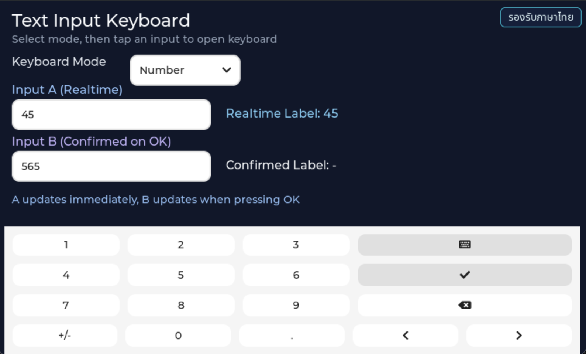

# EP03 — Text Input Keyboard (พิมพ์ข้อความเข้าหน้าจอ)

> **Series:** HMI Menu & Setting • **Episode:** 3 / 7 • **ระดับ:** beginner

## Screenshot



## Why — ทำไมต้องเรียนตัวอย่างนี้?

HMI ส่วนใหญ่ต้องให้ผู้ใช้ "พิมพ์อะไรบางอย่าง" — ชื่อ WiFi, password, ค่า setpoint
ของเซ็นเซอร์, หมายเลขเครื่อง ฯลฯ บอร์ดเราไม่มี hardware keyboard ติดมาด้วย ดังนั้น
เราต้องแสดง **on-screen keyboard** ขึ้นมาแทน

LVGL มี `lv_keyboard` widget ที่ใช้งานได้ทันทีโดยไม่ต้องวาด layout เอง แต่การจะต่อ
มันเข้ากับ `lv_textarea` และจัดการ workflow ให้ผู้ใช้ — tap ช่องไหนคีย์บอร์ดโผล่ให้ช่องนั้น,
กด OK แล้ว commit, กด Cancel แล้วกลับไปยังค่าเดิม — ต้องอาศัย event flow ที่
ถูกต้อง

ep03 ยังสอน **2 โหมดของ textarea** ที่ต่างกันโดยสิ้นเชิง:

1. **Realtime input** — ทุก keystroke ถูกอัปเดตเข้า model ทันที (เหมาะกับ search box)
2. **Commit-on-OK input** — จะ update model ก็ต่อเมื่อผู้ใช้กด OK (เหมาะกับ form ที่
   ต้อง validate ก่อน apply)

พร้อมทั้ง `lv_dropdown` ที่ให้ผู้ใช้สลับ keyboard ระหว่างโหมด **Normal** (QWERTY เต็ม)
กับ **Number** (ตัวเลขกับสัญลักษณ์) — ใช้ตัวแปร
`LV_KEYBOARD_MODE_TEXT_LOWER` / `LV_KEYBOARD_MODE_NUMBER`

## What — ตัวอย่างนี้แสดงอะไร?

- พื้นหลังและ logo (โลโก้ถูกวางมุมล่างกลาง เพราะพื้นที่บนต้องใช้วาด input ทั้งหมด)
- หัวเรื่อง "Text Input Keyboard" + คำอธิบาย "Select mode, then tap an input to
  open keyboard"
- **Dropdown "Keyboard Mode"** ที่มีตัวเลือก `Normal\nNumber`
- **Input A (Realtime)** — `lv_textarea` แบบ single-line มี placeholder; กดแล้ว
  keyboard โผล่, พิมพ์ทุกตัวแสดงบน label "A:" ข้าง ๆ ทันที
- **Input B (Commit on OK)** — `lv_textarea` อีกตัว; พิมพ์ลงไปไม่กระทบ label "B:"
  จนกว่าจะกด OK บน keyboard (หรือกด Cancel กลับไปค่าเดิม)
- **Keyboard widget** ซ่อนอยู่ล่างจอ โผล่ขึ้นมาเฉพาะเวลาคลิก textarea แล้วหาย
  เมื่อกด OK/Cancel

### ไฟล์ที่มีใน episode นี้

| File | บทบาท |
| --- | --- |
| `main_example.c` | forward `example_main()` → `ui_text_input_keyboard_create()` |
| `ui_text_input_keyboard.c` / `.h` | สร้าง UI tree: dropdown, 2 textarea, 2 label, keyboard |
| `ui_text_input_layout.h` | รวม layout constant (ตำแหน่ง, ขนาด, สี) เพื่อเลี่ยง magic number |
| `text_input_logic.c` / `.h` | state struct + event callback ทั้งหมด (focus/commit/mode change) |
| `app_logo.c` / `.h` + `APP_LOGO.png` | โลโก้ embed |

## How — ทำงานอย่างไร?

### ขั้นที่ 1: สร้าง textarea 2 ตัว พร้อมจำแนกหน้าที่

```c
lv_obj_t *realtime_input = lv_textarea_create(screen);
lv_textarea_set_one_line(realtime_input, true);
lv_textarea_set_placeholder_text(realtime_input, "tap to type...");
```

textarea 2 ตัวแทบจะเหมือนกัน สิ่งที่ต่างคือ **event ที่ mark ไว้** — tag ผ่าน
`lv_obj_set_user_data(ta, &s_text_input_state)` เพื่อ callback รู้ว่ากำลังพิมพ์อยู่ช่องไหน

### ขั้นที่ 2: สร้าง keyboard และซ่อนไว้

```c
lv_obj_t *keyboard = lv_keyboard_create(screen);
lv_obj_add_flag(keyboard, LV_OBJ_FLAG_HIDDEN);
```

Keyboard เริ่ม hidden — จะ show เมื่อ textarea ได้รับ `LV_EVENT_FOCUSED`
และ hide เมื่อได้ `LV_EVENT_DEFOCUSED` หรือ `LV_EVENT_READY`/`LV_EVENT_CANCEL`

### ขั้นที่ 3: Callback ที่ผูกต่อ

มี callback หลักใน `text_input_logic.c`:

- `text_input_logic_focus_cb` — รับ `LV_EVENT_FOCUSED` → `lv_keyboard_set_textarea(kb, ta)`
  + `lv_obj_clear_flag(kb, LV_OBJ_FLAG_HIDDEN)`
- `text_input_logic_realtime_change_cb` — รับ `LV_EVENT_VALUE_CHANGED` จาก textarea A →
  sync ข้อความไปที่ label A
- `text_input_logic_ready_cb` — รับ `LV_EVENT_READY` (= ผู้ใช้กด OK) → commit
  ข้อความลง label B และซ่อน keyboard
- `text_input_logic_cancel_cb` — รับ `LV_EVENT_CANCEL` → restore ค่าเดิมและซ่อน
- `text_input_logic_mode_cb` — รับ `LV_EVENT_VALUE_CHANGED` จาก dropdown →
  `lv_keyboard_set_mode(kb, LV_KEYBOARD_MODE_NUMBER)` หรือ `TEXT_LOWER`

### ขั้นที่ 4: การจัดการ state กลาง

`s_text_input_state` เป็น `static` struct ที่เก็บ pointer ของ widget ทุกตัว
(`keyboard`, `realtime_input`, `commit_input`, `label_a`, `label_b`, `mode_dropdown`)
callback ทุกตัวเข้าถึง state นี้ได้เหมือนกัน ไม่มีการใช้ global variable กระจัดกระจาย

## วิธีติดตั้งและรัน

```sh
cd tesaiot_dev_kit_master

find proj_cm55/apps -mindepth 1 -maxdepth 1 \
     ! -name 'app_interface.h' ! -name 'README.md' ! -name '_default' \
     -exec rm -rf {} +

rsync -a ../episodes/hmi_ep03_text_input_keyboard/ proj_cm55/apps/

make clean
make program TARGET=APP_KIT_PSE84_AI CONFIG_DISPLAY=WS7P0DSI_RPI_DISP
```

## สิ่งที่จะเห็นบนหน้าจอ

- หน้าจอว่าง ๆ ด้านบนมี title, subtitle และ dropdown "Keyboard Mode"
- 2 ช่อง input (A realtime, B commit) พร้อม label แสดงค่าปัจจุบัน
- แตะช่อง A → keyboard โผล่ข้างล่าง → พิมพ์ → label A เปลี่ยนทุกตัวอักษร
- แตะช่อง B → พิมพ์ → label B ยังไม่เปลี่ยน → กด OK (ปุ่มเช็คเขียว) → label B
  เปลี่ยนเป็นค่าใหม่
- สลับ dropdown เป็น Number → keyboard เปลี่ยนเป็น numeric layout

## อะไรที่คุณสามารถทดลองเปลี่ยนได้?

1. **เพิ่ม placeholder** — `lv_textarea_set_placeholder_text()` ให้ข้อความ hint
2. **จำกัดจำนวนอักษร** — `lv_textarea_set_max_length(ta, 16)`
3. **ตั้ง password mode** — `lv_textarea_set_password_mode(ta, true)` (จะมีประโยชน์
   มากใน ep06 ตอนกรอก WiFi password)
4. **เพิ่ม validation** — ใน `ready_cb` ลอง reject ถ้า input ว่าง
5. **เพิ่มโหมด hex** — เติม `LV_KEYBOARD_MODE_TEXT_UPPER` หรือ custom keymap

## ศัพท์ที่ต้องรู้

- **`lv_textarea`** — widget สำหรับ editable text มี cursor และ selection
- **`lv_keyboard`** — on-screen keyboard พร้อม layout สำเร็จรูป
- **`LV_EVENT_FOCUSED`** — ยิงเมื่อ widget ได้รับ focus (user แตะเข้า)
- **`LV_EVENT_DEFOCUSED`** — ยิงเมื่อ widget เสีย focus
- **`LV_EVENT_READY`** — ยิงเมื่อ user กด OK บน keyboard
- **`LV_EVENT_CANCEL`** — ยิงเมื่อ user กด Cancel/Close
- **`LV_EVENT_VALUE_CHANGED`** — ยิงเมื่อค่าของ widget เปลี่ยน (ทุก keystroke สำหรับ textarea)
- **`lv_keyboard_set_textarea(kb, ta)`** — ผูก keyboard กับ textarea target
- **`LV_KEYBOARD_MODE_TEXT_LOWER` / `LV_KEYBOARD_MODE_NUMBER`** — enum โหมด layout

## ขั้นต่อไป

**EP04 — Menu Navigation** จะรวมทักษะที่เรียนมา (label, button, textarea) เป็น
**หน้าหลัก + sub-page** พร้อม top navigation bar ที่สลับหน้าได้ และจะเป็นโครง
สำคัญที่ ep05-07 ใช้ต่อสำหรับ WiFi scan / profile / manager
