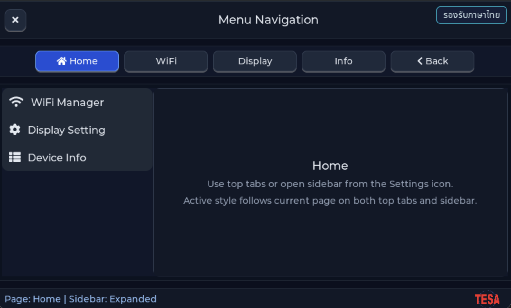

# EP04 — Menu Navigation (โครงเมนูหลักของทั้ง series)

> **Series:** HMI Menu & Setting • **Episode:** 4 / 7 • **ระดับ:** beginner

## Screenshot



## Why — ทำไมต้องเรียนตัวอย่างนี้?

จนถึง ep03 เราวาดหน้าจอ "เดียว" ที่ทำงานเสร็จในตัวเอง แต่ในแอป HMI จริงผู้ใช้
ต้องสลับระหว่างหน้าต่าง ๆ ได้ — Home / Settings / WiFi / Sensors / About ฯลฯ

ep04 สร้าง **navigation shell** ที่จะเป็นกระดูกสันหลังของ ep05-07 โครงนี้ประกอบด้วย:

1. **Header bar** — logo + title + icon action buttons (refresh, info) ที่ลอยอยู่บน
   สุดของหน้าจอตลอดเวลา
2. **Top nav row** — ปุ่มแนวนอนที่แสดง "ชื่อหน้า" ทั้งหมด; แตะแล้วสลับ active page
3. **Stage container** — พื้นที่กลางจอที่ "เปลี่ยนเนื้อหา" ตาม active page
4. **Footer status** — แถบล่างเล็ก ๆ สำหรับ status text (เช่น "Ready", "Connected")

pattern แบบนี้ใช้ซ้ำใน ep05 (เพิ่ม WiFi List page), ep06 (เพิ่ม WiFi Profile page),
ep07 (เพิ่ม Connection / Status page) — ถ้าเข้าใจ ep04 แล้ว 3 episode หลังจะอ่านง่าย
ขึ้นมาก

คุณจะได้เรียน:

- วิธีแบ่งหน้าจอใหญ่เป็น region ด้วย child containers (header / nav / stage / footer)
- การสร้าง button array แบบ dynamic พร้อมผูก "page index" เป็น user_data
- การ clear + rebuild stage container เพื่อสลับหน้า
- Layout constant ที่อยู่ในไฟล์ `.h` เดียว (`ui_menu_layout.h`) เพื่อให้แก้ทีเดียว
  กระทบทุกหน้า

## What — ตัวอย่างนี้แสดงอะไร?

- **Header bar** ด้านบน: logo TESAIoT + title "HMI Menu Navigation" + ปุ่ม icon
  วงกลม 2 ปุ่มขวามือ (ใช้ Font Awesome symbol ของ LVGL เช่น `LV_SYMBOL_REFRESH`)
- **Top nav row** ใต้ header: มีปุ่ม "Home", "Page A", "Page B", "About" ที่เมื่อ
  active จะมีพื้นหลังเข้มขึ้น (`UI_MENU_NAV_BTN_BG_ACTIVE_HEX`)
- **Stage container** ตรงกลาง: วาด content ของหน้าปัจจุบัน — ถ้าเลือก Home
  จะเห็นข้อความต้อนรับ, เลือก Page A จะเห็นตัวอย่าง label, เลือก About จะเห็น
  credit + version
- **Footer status** ด้านล่าง: strip เล็ก ๆ แสดงข้อความ state

### ไฟล์ที่มีใน episode นี้

| File | บทบาท |
| --- | --- |
| `main_example.c` | forward `example_main()` → `ui_menu_navigation_create()` |
| `nav/ui_menu_navigation.c` / `.h` | สร้าง shell: header, nav row, stage, footer |
| `nav/ui_menu_layout.h` | layout constants (ขนาด, padding, สี, hex) ของทุก component |
| `nav/menu_nav_logic.c` / `.h` | state struct + callback สำหรับ switch page + update active style |
| `assets/app_logo.c` / `.h` + `APP_LOGO.png` | โลโก้ embed |

## How — ทำงานอย่างไร?

### ขั้นที่ 1: `ui_menu_navigation_create()` สร้าง shell ทั้งหมด

```c
lv_obj_t *screen = lv_screen_active();

lv_obj_t *header = lv_obj_create(screen);   /* header bar */
lv_obj_t *nav_row = lv_obj_create(screen);  /* top nav container */
lv_obj_t *stage = lv_obj_create(screen);    /* content area */
lv_obj_t *footer = lv_obj_create(screen);   /* status strip */
```

แต่ละ container ใช้ `LV_LAYOUT_FLEX` เพื่อจัดลูกอัตโนมัติ และถูก align ด้วย
`LV_ALIGN_TOP_MID` / `LV_ALIGN_BOTTOM_MID` โดยอิงขนาดจาก `ui_menu_layout.h`
(เช่น `UI_MENU_HEADER_H`, `UI_MENU_NAV_BTN_W`)

### ขั้นที่ 2: สร้าง icon button ใน header

```c
static lv_obj_t *create_header_icon_button(lv_obj_t *parent,
                                           const char *symbol,
                                           lv_obj_t **out_label)
{
    lv_obj_t *btn = lv_button_create(parent);
    lv_obj_set_size(btn, UI_MENU_ICON_BTN_SIZE, UI_MENU_ICON_BTN_SIZE);
    lv_obj_set_style_radius(btn, 10, LV_PART_MAIN);

    lv_obj_t *label = lv_label_create(btn);
    lv_label_set_text(label, symbol);
    /* ... */
    return btn;
}
```

Helper นี้ย่อ boilerplate การสร้าง button + label ภายในให้เหลือบรรทัดเดียว
`out_label` ให้ caller เอา label pointer ไปเปลี่ยนไอคอนได้ภายหลัง

### ขั้นที่ 3: Top nav button array

`create_top_nav_button()` คล้ายกันแต่ขนาดเป็นสี่เหลี่ยม และมี text ข้าง ๆ แต่ละปุ่ม
ถูก register callback เดียวกัน (`menu_nav_logic_select_cb`) โดย user_data เป็น
**page index**

```c
lv_obj_add_event_cb(btn_home, menu_nav_logic_select_cb,
                    LV_EVENT_CLICKED, (void *)(uintptr_t)0);
lv_obj_add_event_cb(btn_page_a, menu_nav_logic_select_cb,
                    LV_EVENT_CLICKED, (void *)(uintptr_t)1);
```

### ขั้นที่ 4: `menu_nav_logic_select_cb` สลับหน้า

```c
void menu_nav_logic_select_cb(lv_event_t *e)
{
    uintptr_t index = (uintptr_t)lv_event_get_user_data(e);
    menu_nav_state_t *s = &s_menu_nav_state;

    /* 1. Clear stage */
    lv_obj_clean(s->stage);

    /* 2. Rebuild page content based on index */
    switch(index) {
        case 0: render_home_page(s->stage); break;
        case 1: render_page_a(s->stage);    break;
        /* ... */
    }

    /* 3. Update nav button active styling */
    update_nav_active_style(s, index);
}
```

`lv_obj_clean()` ทำลาย child ทั้งหมดของ stage โดยไม่แตะตัว stage เอง — เร็วกว่า
delete แล้ว create ใหม่ และไม่ leak memory

### ขั้นที่ 5: Layout constant

`ui_menu_layout.h` รวม `#define` ของ ทุกขนาด ตำแหน่ง สี ไว้ที่เดียว เช่น:

```c
#define UI_MENU_NAV_BTN_W            160
#define UI_MENU_NAV_BTN_H            56
#define UI_MENU_NAV_BTN_BG_HEX       0x1E293B
#define UI_MENU_NAV_BTN_BG_ACTIVE_HEX 0x0EA5E9
#define UI_MENU_NAV_BTN_BORDER_HEX   0x334155
```

แก้ theme ทั้งแอปเปลี่ยนไฟล์เดียว — ห้ามใช้ magic number กระจัดกระจาย

## วิธีติดตั้งและรัน

```sh
cd tesaiot_dev_kit_master

find proj_cm55/apps -mindepth 1 -maxdepth 1 \
     ! -name 'app_interface.h' ! -name 'README.md' ! -name '_default' \
     -exec rm -rf {} +

rsync -a ../episodes/hmi_ep04_menu_navigation/ proj_cm55/apps/

make clean
make program TARGET=APP_KIT_PSE84_AI CONFIG_DISPLAY=WS7P0DSI_RPI_DISP
```

## สิ่งที่จะเห็นบนหน้าจอ

- แถบ header ดำ-น้ำเงินเข้มด้านบน มีโลโก้ซ้ายและไอคอนขวา
- แถวปุ่ม nav 4 ปุ่มใต้ header
- กลางจอเป็นพื้นที่เนื้อหาของหน้า Home (ข้อความต้อนรับ)
- แตะ "Page A" → พื้นที่กลางเปลี่ยนเป็นเนื้อหาของ Page A
- Footer strip ด้านล่างแสดงสถานะ

## อะไรที่คุณสามารถทดลองเปลี่ยนได้?

1. **เพิ่มหน้าใหม่** — copy function `render_page_a` ทำเป็น `render_page_c`
   แล้วเพิ่มปุ่มใน nav row + case ใน switch
2. **เปลี่ยนสี active** — แก้ `UI_MENU_NAV_BTN_BG_ACTIVE_HEX` ใน layout header
3. **เพิ่ม badge** — วาด circle เล็ก ๆ มุมขวาบนของปุ่ม nav แสดง notification count
4. **ทำให้ header มี animation** — `lv_obj_set_style_translate_y()` + `lv_anim_t`
5. **ใช้ tabview แทน** — ลอง refactor เป็น `lv_tabview_create()` ดูว่าโค้ดสั้นขึ้น
   แต่ control ลดลงแค่ไหน

## ศัพท์ที่ต้องรู้

- **Navigation shell** — pattern แบ่งหน้าจอเป็น header/nav/content/footer
- **`lv_obj_clean(obj)`** — ลบ child ทั้งหมดแต่เก็บ obj เอง
- **Stage container** — พื้นที่กลางจอที่เนื้อหาถูก rebuild ทุกครั้งที่เปลี่ยนหน้า
- **`LV_SYMBOL_*`** — Font Awesome glyph ที่ LVGL ฝังไว้ (REFRESH, SETTINGS, HOME, ...)
- **Layout constant** — `#define` ที่รวมขนาด/สีไว้ที่เดียว (DRY principle)
- **`LV_EVENT_CLICKED`** — ยิงเมื่อ press แล้ว release ภายในพื้นที่ button
- **`(uintptr_t)index`** — trick ใส่ index เป็น void* user_data โดยไม่ alloc
- **`lv_obj_add_state(obj, LV_STATE_CHECKED)`** — วิธี mark ว่าปุ่มอยู่ active state

## ขั้นต่อไป

**EP05 — WiFi List** จะใช้ shell นี้เพิ่มหน้าใหม่: scan WiFi networks ด้วย
`whd` driver แล้วแสดงผลเป็น `lv_list` (หรือ flex column ของปุ่ม) พร้อม RSSI
และ security type
