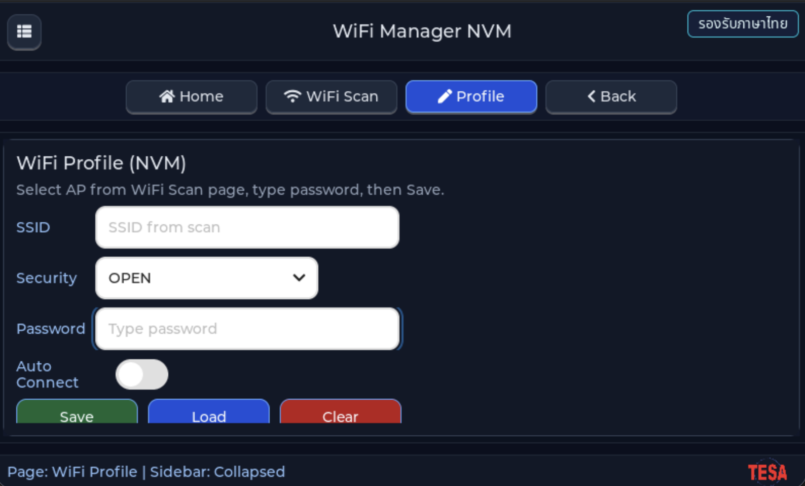

# EP06 — WiFi Profile NVM (จำ SSID + password ข้ามการรีบูต)

> **Series:** HMI Menu & Setting • **Episode:** 6 / 7 • **ระดับ:** intermediate

## Screenshot



## Why — ทำไมต้องเรียนตัวอย่างนี้?

ep05 scan WiFi ได้แล้ว แต่ทุกครั้งที่ผู้ใช้ปิดเครื่อง/รีบูต list ก็หายหมด
และถ้าต้องการต่อ WiFi จริง ก็ต้องให้ผู้ใช้ **พิมพ์ password** ทุกครั้ง — เป็น UX ที่แย่มาก

HMI ที่ใช้งานได้จริงต้องมี "WiFi profile" ที่:

1. จำ SSID + password + security type ไว้
2. บันทึกลง **NVM (non-volatile memory)** เพื่อไม่หายตอนไฟดับ
3. โหลดกลับมาเมื่อ boot ครั้งต่อไป
4. ให้ผู้ใช้แก้ / ลบได้ผ่าน form

ep06 คือตัวอย่างการ implement wiring นี้ทั้งหมด พร้อมแสดงข้อมูลที่น่ากลัวน้อยลง —
password ถูกแสดงเป็น `••••••••` (dot mask) โดยใช้ `lv_textarea_set_password_mode(ta, true)`

คุณจะได้เรียน:

- **Storage abstraction** — `wifi_profile_store.c` wrap layer เหนือ flash/NVS
  API ให้ UI เรียกแค่ `save()`, `load()`, `clear()`
- **Form pattern** — รวม textarea หลายตัวเป็น "profile form" พร้อม validate
- **Password mode** ของ `lv_textarea` (จาก ep03 ต่อยอดมาใช้จริง)
- **Cross-page data flow** — แตะ AP ใน ep05 list → auto-fill SSID ในหน้า profile
  (ผ่าน `menu_nav_logic` global state)

## What — ตัวอย่างนี้แสดงอะไร?

- Navigation shell + nav button "Scan" / "Profile"
- **Page Scan** — เหมือน ep05
- **Page Profile** (ใหม่ใน ep06):
  - Label "WiFi Profile" + subtitle
  - Form field: **SSID** (`lv_textarea`, single-line, max 32 chars)
  - Form field: **Password** (`lv_textarea`, password_mode = true, max 63 chars)
  - Dropdown: **Security** (`Open`, `WPA/WPA2`, `WPA3`)
  - 3 ปุ่ม: **Save**, **Load**, **Clear**
  - Status label แสดงผล ("Profile saved", "No profile found", "Profile cleared")
- Tap แถวใน scan list → auto-switch ไปหน้า Profile แล้ว pre-fill SSID

### ไฟล์ที่มีใน episode นี้

| File | บทบาท |
| --- | --- |
| `main_example.c` | pre-init WiFi + forward เข้า `ui_wifi_profile_nvm_create()` |
| `nav/*` | shell จาก ep04 (เพิ่ม profile page) |
| `wifi_list/*` | scan page จาก ep05 (re-used) |
| `wifi_profile/ui_wifi_profile_page.c` / `.h` | สร้าง form + ปุ่ม save/load/clear + callback |
| `wifi_profile/wifi_profile_store.c` / `.h` | NVM wrapper: `save()`, `load()`, `clear()` |
| `wifi_profile/wifi_profile_types.h` | struct `wifi_profile_data_t` + size constants |
| `assets/*` | โลโก้ |

## How — ทำงานอย่างไร?

### ขั้นที่ 1: `wifi_profile_data_t` struct

```c
#define WIFI_PROFILE_SSID_MAX_LEN     32
#define WIFI_PROFILE_PASSWORD_MAX_LEN 64
#define WIFI_PROFILE_SECURITY_MAX_LEN 16

typedef struct {
    char ssid[WIFI_PROFILE_SSID_MAX_LEN + 1];
    char password[WIFI_PROFILE_PASSWORD_MAX_LEN + 1];
    char security[WIFI_PROFILE_SECURITY_MAX_LEN + 1];
    uint32_t magic;   /* ตรวจว่า slot valid */
} wifi_profile_data_t;
```

`magic` เป็น constant เช่น `0x57494649` ("WIFI") — ใช้เช็คว่า slot ที่อ่านมาจาก
NVM ไม่ใช่ข้อมูลขยะจาก uninitialized flash

### ขั้นที่ 2: Profile store abstraction

```c
bool wifi_profile_store_save(const wifi_profile_data_t *p);
bool wifi_profile_store_load(wifi_profile_data_t *out);
bool wifi_profile_store_clear(void);
```

Implementation ข้างใน (`wifi_profile_store.c`) จะใช้ API ของ PSoC flash
(เช่น `cyhal_flash_*` หรือ `cy_em_eeprom` หรือ MCUboot NVS depending on board)
UI ไม่ต้องรู้ — แค่เรียก 3 ฟังก์ชันนี้

### ขั้นที่ 3: Build profile form

```c
lv_obj_t *ssid_ta = lv_textarea_create(form);
lv_textarea_set_one_line(ssid_ta, true);
lv_textarea_set_max_length(ssid_ta, WIFI_PROFILE_SSID_MAX_LEN);
lv_textarea_set_placeholder_text(ssid_ta, "SSID");

lv_obj_t *pwd_ta = lv_textarea_create(form);
lv_textarea_set_one_line(pwd_ta, true);
lv_textarea_set_password_mode(pwd_ta, true);   /* ★ mask เป็น dot */
lv_textarea_set_max_length(pwd_ta, WIFI_PROFILE_PASSWORD_MAX_LEN);
lv_textarea_set_placeholder_text(pwd_ta, "Password");

lv_obj_t *sec_dd = lv_dropdown_create(form);
lv_dropdown_set_options(sec_dd, "Open\nWPA/WPA2\nWPA3");
```

ทั้งหมดใช้ `lv_keyboard` ที่ตั้งค่าจาก ep03 — แตะเข้า textarea → keyboard โผล่

### ขั้นที่ 4: Save callback

```c
static void on_save_click(lv_event_t *e)
{
    wifi_profile_data_t p = {0};
    strlcpy(p.ssid, lv_textarea_get_text(s_ssid_ta), sizeof(p.ssid));
    strlcpy(p.password, lv_textarea_get_text(s_pwd_ta), sizeof(p.password));
    /* ... ดึง security จาก dropdown ... */
    p.magic = 0x57494649U;

    bool ok = wifi_profile_store_save(&p);
    lv_label_set_text(s_status,
        ok ? "Profile saved" : "Save failed");
}
```

### ขั้นที่ 5: Load ตอน boot

```c
static void on_load_click(lv_event_t *e)
{
    wifi_profile_data_t p;
    if(wifi_profile_store_load(&p)) {
        lv_textarea_set_text(s_ssid_ta, p.ssid);
        lv_textarea_set_text(s_pwd_ta, p.password);
        /* select dropdown index ตาม p.security */
        lv_label_set_text(s_status, "Profile loaded");
    } else {
        lv_label_set_text(s_status, "No profile found");
    }
}
```

### ขั้นที่ 6: Auto-fill จาก Scan page

เมื่อผู้ใช้ tap แถวใน scan list, `ui_wifi_list_page.c` จะ:

1. เก็บ SSID ที่เลือกลง `menu_nav_state.pending_ssid`
2. เรียก switch page ไปหน้า profile
3. `render_profile_page()` เช็คว่า `pending_ssid` ไม่ว่าง → pre-fill textarea

นี่คือ cross-page data passing pattern ที่จะใช้ซ้ำใน ep07

## วิธีติดตั้งและรัน

```sh
cd tesaiot_dev_kit_master

find proj_cm55/apps -mindepth 1 -maxdepth 1 \
     ! -name 'app_interface.h' ! -name 'README.md' ! -name '_default' \
     -exec rm -rf {} +

rsync -a ../episodes/hmi_ep06_wifi_profile_nvm/ proj_cm55/apps/

make clean
make program TARGET=APP_KIT_PSE84_AI CONFIG_DISPLAY=WS7P0DSI_RPI_DISP
```

## สิ่งที่จะเห็นบนหน้าจอ

- หน้า Scan (ทำงานเหมือน ep05)
- สลับไปหน้า Profile → มี form 3 field + 3 ปุ่ม
- กรอก SSID/password → กด Save → status แสดง "Profile saved"
- Reboot บอร์ด → เปิดหน้า Profile → กด Load → ค่าที่บันทึกไว้โผล่กลับมา
- Tap AP ในหน้า Scan → auto-jump มาหน้า Profile พร้อม SSID กรอกให้แล้ว

## อะไรที่คุณสามารถทดลองเปลี่ยนได้?

1. **Auto-load ตอน boot** — เรียก `wifi_profile_store_load()` ใน `example_main`
2. **Toggle แสดง password** — เพิ่มปุ่ม "eye" ที่สลับ `password_mode` on/off
3. **เก็บหลาย profile** — ขยาย store เป็น array 4 slot
4. **Validate password** — reject ถ้าน้อยกว่า 8 ตัว (WPA2 requirement)
5. **Add profile list page** — หน้าที่ show profile ที่ save ไว้แล้วเลือก delete ได้

## ศัพท์ที่ต้องรู้

- **NVM (Non-Volatile Memory)** — หน่วยความจำที่เก็บข้อมูลข้ามไฟดับ (flash, EEPROM)
- **`lv_textarea_set_password_mode(ta, true)`** — แสดงตัวอักษรที่พิมพ์เป็น dot
- **`lv_textarea_set_max_length(ta, n)`** — จำกัดจำนวนตัวอักษร
- **Magic number** — ค่า constant ที่ใช้เช็คว่า slot NVM เคยถูก write มาก่อน
- **Store abstraction** — layer ที่ wrap storage API ให้ UI ไม่ต้องรู้ backend
- **Password dot mask** — แสดง `••••` แทนตัวอักษรจริง
- **`strlcpy`** — `strcpy` ที่ปลอดภัยกว่า (ตัดให้พอดี buffer เสมอ)
- **Cross-page state** — state global ที่ใช้ส่งข้อมูลจากหน้าหนึ่งไปอีกหน้า

## ขั้นต่อไป

**EP07 — Final WiFi Manager** จะเอา Profile + Scan มาเชื่อมกับ
**connection service** — บอร์ดจะใช้ profile ที่ save ไว้ต่อ WiFi จริง,
auto-reconnect ตอนสัญญาณหลุด, และแสดง state machine บนหน้าจอ
(IDLE → CONNECTING → CONNECTED → RECONNECT_WAIT)
