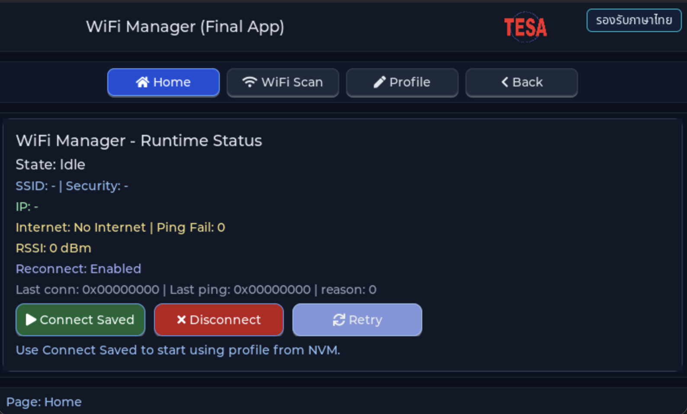

# EP07 — Final WiFi Manager (WiFi manager ครบทุกชั้น)

> **Series:** HMI Menu & Setting • **Episode:** 7 / 7 • **ระดับ:** intermediate

## Screenshot



## Why — ทำไมต้องเรียนตัวอย่างนี้?

ep05 สอนการ scan, ep06 สอนการเก็บ profile ลง NVM — แต่ทั้งสอง episode ยังไม่
**เชื่อมต่อ** WiFi จริง ep07 คือตอนสุดท้ายที่รวมทุกอย่างเข้าด้วยกันเป็น
"WiFi manager ที่ใช้งานจริงได้":

1. Boot ขึ้นมา → โหลด profile จาก NVM (ep06) → auto-connect ทันที
2. ถ้าต่อไม่ติด → retry ตาม ladder (1s → 5s → 15s → 60s)
3. เมื่อต่อได้ → start ping watchdog เช็คว่ายังออก internet ได้จริง
4. ถ้า ping fail หลายครั้ง → mark disconnected → retry ladder อีกรอบ
5. ถ้าผู้ใช้เลือก SSID ใหม่จาก scan → disconnect + connect ใหม่

นอกจากนั้น UI แสดง **state machine** แบบชัดเจน:
`IDLE → CONNECTING → CONNECTED → RECONNECT_WAIT → ERROR`

ep07 เป็นตัวอย่างของ pattern ระดับ production: service layer ที่ถือ state อยู่
background และ UI เป็นแค่ "observer" ที่ poll snapshot มาแสดง — ไม่ให้ UI ถือ
state เอง เพราะ UI อาจถูก rebuild ทุกครั้งที่สลับหน้า

คุณจะได้เรียน:

- **State machine design** แบบ explicit enum + transition function
- **Observer pattern** — UI dequeue snapshot ทุก N ms ผ่าน `lv_timer`
- **Retry ladder** — `retry_wait_ms` เพิ่มเท่าตัว แทน fixed interval
- **Ping watchdog** — เช็คว่า connected ยังหมายถึง internet ใช้ได้จริง
- **Thread safety** — service รันใน own task, UI อ่าน snapshot ผ่าน getter
  (`wifi_connection_service_get_snapshot()`) ที่ copy ค่าออกมาให้

## What — ตัวอย่างนี้แสดงอะไร?

- Navigation shell + 3 pages: **Scan**, **Profile**, **Status** (ใหม่)
- **Page Status** (หน้าหลักของ ep07) — แสดง:
  - State badge ใหญ่ (IDLE / CONNECTING / CONNECTED / RECONNECT_WAIT / ERROR)
    พร้อมสีที่เปลี่ยนตาม state (เขียว/ส้ม/แดง)
  - Current SSID + security
  - IP address (เมื่อ CONNECTED)
  - RSSI
  - Retry stage + next retry in (sec)
  - Ping status ("internet OK" / "ping fail 3")
  - 3 ปุ่ม: **Connect**, **Disconnect**, **Retry now**
  - Toggle: **Auto reconnect** (on/off)

### State machine (enum จาก `wifi_connection_service.h`)

```c
typedef enum {
    WIFI_CONN_STATE_IDLE,
    WIFI_CONN_STATE_CONNECTING,
    WIFI_CONN_STATE_CONNECTED,
    WIFI_CONN_STATE_DISCONNECTING,
    WIFI_CONN_STATE_RECONNECT_WAIT,
    WIFI_CONN_STATE_ERROR
} wifi_conn_state_t;
```

### ไฟล์ที่มีใน episode นี้

| File | บทบาท |
| --- | --- |
| `main_example.c` | `wifi_connection_service_init()` แล้ว forward เข้า `ui_wifi_manager_final_create()` |
| `nav/*` | shell จาก ep04 |
| `wifi_list/*` | scan page จาก ep05 (re-used) |
| `wifi_profile/*` | profile page + store จาก ep06 (re-used) |
| `wifi_conn/ui_wifi_status_page.c` / `.h` | หน้า status ใหม่ + observer timer |
| `wifi_conn/wifi_connection_service.c` / `.h` | state machine + retry + ping watchdog |
| `assets/*` | โลโก้ |

## How — ทำงานอย่างไร?

### ขั้นที่ 1: `wifi_connection_service_init()`

เรียก **ครั้งเดียว** ตอน boot จาก `main_example.c` ภายในจะ:

1. `cy_wcm_init()` interface STA
2. โหลด profile จาก NVM (ถ้ามี)
3. ถ้าโหลดสำเร็จ + profile valid → transition `IDLE → CONNECTING` (auto-connect)
4. สร้าง background task ที่หมุน state machine

```c
/* main_example.c */
if(!wifi_connection_service_init()) {
    printf("[WIFI_MGR] connection_service_init failed\r\n");
}
ui_wifi_manager_final_create();
```

### ขั้นที่ 2: State transitions

```c
switch(s->state) {
    case WIFI_CONN_STATE_IDLE:
        if(s->have_profile && s->reconnect_enabled) {
            start_connect();
            s->state = WIFI_CONN_STATE_CONNECTING;
        }
        break;

    case WIFI_CONN_STATE_CONNECTING:
        if(connect_success)     s->state = WIFI_CONN_STATE_CONNECTED;
        else if(connect_failed) s->state = WIFI_CONN_STATE_RECONNECT_WAIT;
        break;

    case WIFI_CONN_STATE_CONNECTED:
        if(ping_fail_streak > 3) s->state = WIFI_CONN_STATE_RECONNECT_WAIT;
        if(whd_disconnect_evt)   s->state = WIFI_CONN_STATE_RECONNECT_WAIT;
        break;

    case WIFI_CONN_STATE_RECONNECT_WAIT:
        if(elapsed >= s->retry_wait_ms) {
            bump_retry_stage(s);
            s->state = WIFI_CONN_STATE_CONNECTING;
        }
        break;
    /* ... */
}
```

### ขั้นที่ 3: Retry ladder

```c
static void bump_retry_stage(state_t *s)
{
    s->retry_stage++;
    switch(s->retry_stage) {
        case 1: s->retry_wait_ms = 1000;  break;
        case 2: s->retry_wait_ms = 5000;  break;
        case 3: s->retry_wait_ms = 15000; break;
        default: s->retry_wait_ms = 60000; break;  /* cap at 60s */
    }
}
```

Exponential backoff ป้องกันการ spam driver เมื่อ AP หาย

### ขั้นที่ 4: UI observer

หน้า status ไม่ได้เก็บ state ของ connection เอง — มันแค่ `lv_timer_create()`
ทุก 500 ms เพื่อเรียก:

```c
static void observe_tick(lv_timer_t *t)
{
    wifi_connection_snapshot_t snap;
    if(wifi_connection_service_get_snapshot(&snap)) {
        /* อัปเดต label ทุกตัวตาม snap */
        lv_label_set_text(s_state_badge,
            wifi_connection_service_state_text(snap.state));
        lv_label_set_text_fmt(s_ssid_lbl, "%s", snap.ssid);
        lv_label_set_text_fmt(s_rssi_lbl, "%d dBm", snap.rssi);
        lv_label_set_text_fmt(s_ip_lbl,   "%s", snap.ip_addr);
        /* ... */
    }
}
```

`get_snapshot()` ภายในจะ lock → memcpy → unlock ให้ ไม่ต้องกลัว race

### ขั้นที่ 5: ปุ่มผู้ใช้ → service API

```c
static void on_connect_click(lv_event_t *e) {
    wifi_profile_data_t p;
    if(wifi_profile_store_load(&p)) {
        wifi_connection_service_connect_profile(&p, true);
    }
}

static void on_disconnect_click(lv_event_t *e) {
    wifi_connection_service_disconnect();
}

static void on_retry_click(lv_event_t *e) {
    wifi_connection_service_retry_now();
}
```

UI ไม่ยุ่งกับ `cy_wcm` เลย — เรียกแต่ service API

### ขั้นที่ 6: Cross-page integration

- Tap AP ใน scan list → auto-jump ไปหน้า profile พร้อม pre-fill SSID (จาก ep06)
- กด Save ในหน้า profile → `wifi_connection_service_connect_profile()` เรียกทันที
  (ไม่ต้องไปกดปุ่ม Connect ที่หน้า status แยก)
- หน้า status สังเกต state machine แบบ real-time

## วิธีติดตั้งและรัน

```sh
cd tesaiot_dev_kit_master

find proj_cm55/apps -mindepth 1 -maxdepth 1 \
     ! -name 'app_interface.h' ! -name 'README.md' ! -name '_default' \
     -exec rm -rf {} +

rsync -a ../episodes/hmi_ep07_final_wifi_manager/ proj_cm55/apps/

make clean
make program TARGET=APP_KIT_PSE84_AI CONFIG_DISPLAY=WS7P0DSI_RPI_DISP
```

## สิ่งที่จะเห็นบนหน้าจอ

- Boot → หน้า Status → badge "CONNECTING" (ถ้ามี profile เดิม)
- หลัง 2-5 วิ → badge "CONNECTED" สีเขียว + IP address + RSSI
- ปิด router หรือเดินไกลออก → badge "RECONNECT_WAIT" + countdown
- กลับมา → badge "CONNECTING" → "CONNECTED" อีกครั้ง (auto)
- สลับไป Scan / Profile → แก้ config → กลับมาหน้า Status แบบ state ยังคง

## อะไรที่คุณสามารถทดลองเปลี่ยนได้?

1. **ปรับ retry ladder** — เพิ่ม stage ที่ 120s สำหรับ long outage
2. **เปลี่ยน ping target** — default เช็ค 8.8.8.8 แก้เป็น gateway ของ router
3. **Log timeline** — แสดง state transition 10 รายการล่าสุด (circular buffer +
   `lv_list`)
4. **LED feedback** — ใช้ LED บนบอร์ดแสดง state (เขียว=connected, แดง=error)
5. **รองรับหลาย profile** — extend profile store, auto-fallback ไป profile
   ถัดไปเมื่อ retry หมด

## ศัพท์ที่ต้องรู้

- **State machine** — โครงที่มี state ชัดเจนและ transition ที่กำหนด
- **Observer pattern** — UI อ่าน state จาก service ผ่าน getter (ไม่ถือเอง)
- **Retry ladder** — ตารางเวลา retry ที่เพิ่มเท่าตัว (exponential backoff)
- **Ping watchdog** — เช็คเป็นระยะว่า internet ใช้ได้จริง
- **`cy_wcm_connect_ap`** — API ของ Connection Manager สำหรับ connect
- **`wifi_connection_snapshot_t`** — copy-only struct ที่ UI อ่านได้ปลอดภัย
- **Auto-reconnect** — service เลือก reconnect ให้เองเมื่อหลุด
- **`lv_timer_create(cb, period_ms, user_data)`** — periodic callback ที่รันใน LVGL thread

## ขั้นต่อไป

ถึงตรงนี้คุณจบ **HMI Menu & Setting** series 7 ตอนแล้ว — มีทักษะครบถ้วนที่จะ
สร้างแอป HMI ของคุณเอง: label, button event, text input, menu navigation,
WiFi scan, profile storage, connection management

ตอนต่อไปของ TESAIoT Dev Kit series จะย้ายไปเรื่อง **Integration (INT)** เช่น
sensor fusion, cloud MQTT publish, OTA update ซึ่งใช้ชั้น WiFi manager จาก
ep07 เป็นฐาน ขอให้สนุกกับการสร้างแอปครับ!
