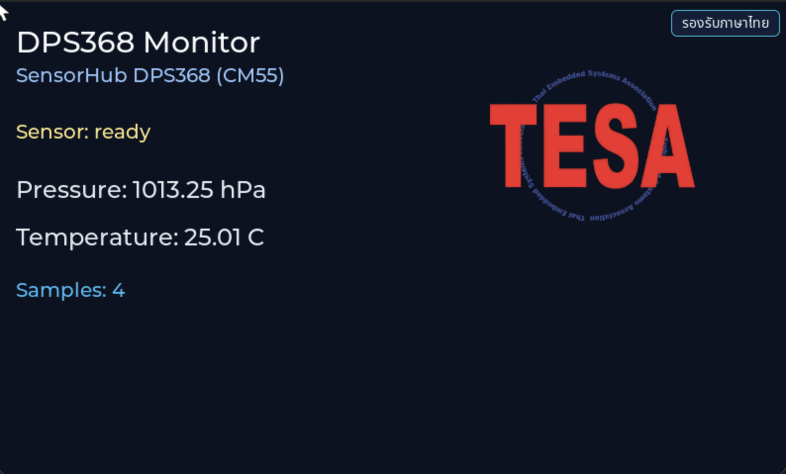

# INT EP01 — DPS368 Pressure & Temperature Monitor

อ่านค่าความดันบรรยากาศและอุณหภูมิจากเซนเซอร์ Infineon **DPS368** แล้วแสดงผลบนจอ LVGL แบบเรียลไทม์

---

## Screenshot



## Why — ทำไมต้องเรียนตอนนี้

DPS368 คือ **เซนเซอร์ความดันบรรยากาศ (barometer)** ที่ผลิตโดย Infineon ใช้หลักการ capacitive MEMS วัดความดันอากาศได้ในช่วง **300 – 1200 hPa** ด้วยความละเอียดระดับ **±0.002 hPa** (เทียบเท่ากับการเปลี่ยนแปลงระดับความสูงประมาณ 2 ซม.)

การอ่านความดันบรรยากาศเป็นหัวใจของหลายแอปพลิเคชัน:

- **Indoor navigation / floor detection** — แยกชั้นอาคารในอุปกรณ์ฉุกเฉิน (เช่น E911 US mandate)
- **Drone altitude hold** — รักษาระดับการบินแบบนิ่ง
- **Weather stations** — พยากรณ์อากาศระยะสั้นจาก pressure trend
- **Fitness trackers** — นับขั้นบันได, วัด elevation gain

ในตอนนี้คุณจะได้เรียนรู้:

1. วิธีคุยกับเซนเซอร์บน I2C bus ที่ master template เตรียมไว้ให้
2. โครงสร้าง **driver → reader → service → presenter → view** ที่ใช้ตลอดซีรีส์
3. วิธีแยก **sensor poll task** ออกจาก **LVGL render loop** ให้ไม่ block กัน
4. การแปลงค่าความดันดิบ (raw) เป็นหน่วย hPa / °C ตามสูตรของ Infineon

> มี legacy files (`basic_label_legacy.c`, `dps368_monitor_legacy.c`) ติดมาด้วย — เป็นเวอร์ชันก่อน refactor ที่เอาไว้เทียบเคียง เหมาะสำหรับคนเพิ่งเริ่ม LVGL

---

## What — ไฟล์ในตอนนี้

| ไฟล์ | หน้าที่ |
|---|---|
| `main_example.c` | Entry wrapper — เรียก `dps368_presenter_start()` ด้วยแฮนเดิล I2C ที่ master เตรียมให้ |
| `app_sensor/dps368/dps368_driver.{c,h}` | เลเยอร์ล่างสุด คุยกับ DPS368 ผ่าน register read/write |
| `app_sensor/dps368/dps368_reader.{c,h}` | คำนวณค่าจริง (hPa / °C) จาก raw และ coefficient |
| `app_sensor/dps368/dps368_config.h` | ตั้งค่า ODR, oversampling, I2C address |
| `app_sensor/dps368/dps368_types.h` | struct ข้อมูลที่ประกาศใช้ร่วมกัน |
| `app_sensor/app_dps368_service.{c,h}` | FreeRTOS task ทำหน้าที่ poll เซนเซอร์ |
| `app_ui/dps368/dps368_presenter.{c,h}` | รับค่าจาก service แล้วป้อนให้ view |
| `app_ui/dps368/dps368_view.{c,h}` | สร้าง LVGL widget (label, arc, bar) |
| `app_ui/app_logo.{c,h}`, `APP_LOGO.png` | โลโก้ด้านบนจอ |
| `app_ui/basic_label_legacy.{c,h}` | โค้ดต้นฉบับก่อน refactor (เปรียบเทียบ) |
| `app_ui/dps368_monitor_legacy.{c,h}` | หน้าจอเวอร์ชันเก่า เอาไว้เทียบ style |

รวมทั้งหมด **20 ไฟล์**

---

## How — อ่านโค้ดทีละชั้น

### ชั้นที่ 1 — Master เตรียม bus ให้เสร็จก่อน

`proj_cm55/main.c` ของ master template เรียก `sensor_i2c_controller_init()` ก่อนที่จะ spawn task ของจอ ผลลัพธ์คือ:

```c
/* จาก platform/sensor_bus.h */
extern mtb_hal_i2c_t sensor_i2c_controller_hal_obj;
```

เป็น **HAL handle ที่พร้อมใช้งาน** — ไม่ต้อง `cyhal_i2c_init()` ซ้ำ

### ชั้นที่ 2 — `main_example.c`

```c
#include "sensor_bus.h"
#include "dps368/dps368_presenter.h"

void example_main(lv_obj_t *parent)
{
    (void)parent;
    dps368_presenter_start(&sensor_i2c_controller_hal_obj);
}
```

แค่ส่ง handle เข้าไป — ที่เหลือ presenter จะ spawn ทั้ง UI และ sensor task เอง

### ชั้นที่ 3 — Presenter spawn FreeRTOS task

`dps368_presenter.c` สร้าง label / gauge บน `lv_scr_act()` แล้ว spawn task ชื่อ `dps368_reader_task` ที่:

1. Probe DPS368 บน address `0x77`
2. โหลด calibration coefficient (c0, c1, c00, c01, … c30)
3. ทุก 100 ms: อ่าน `PRS_B2..B0` + `TMP_B2..B0`
4. แปลงเป็น hPa / °C ตาม Infineon AN แล้ว `xQueueSend()` ไปที่ presenter
5. Presenter ใช้ `lv_async_call()` เข้า LVGL context เพื่อ update label (สำคัญมาก — LVGL ไม่ thread-safe)

### ชั้นที่ 4 — View update loop

`dps368_view_update()` รับ sample แล้ว `lv_label_set_text_fmt()` ใส่ค่าใหม่ บวกกับ animation กราฟเส้น

---

## Install & Run

จาก root ของ master template:

```bash
cd tesaiot_dev_kit_master

# 1) drop episode into apps/
rsync -a ../episodes/int_ep01_dps368_monitor/ proj_cm55/apps/int_ep01_dps368_monitor/

# 2) first-time build: pull deps
make getlibs

# 3) build & program
make build -j
make program
```

จอควรแสดงความดัน (≈ 1013 hPa ที่ระดับน้ำทะเล) และอุณหภูมิห้อง (≈ 25 – 30 °C)

---

## Experiment Ideas

- **วัดระดับความสูง** — ใช้สูตร barometric: `h = 44330 * (1 - (P/P0)^0.1903)` แล้วแสดงเป็นเมตร
- **Trend arrow** — เก็บค่าย้อน 5 นาที วาดลูกศรขึ้น/ลงเพื่อพยากรณ์อากาศสั้นๆ
- **Altitude hold demo** — ยกบอร์ดขึ้น 1 เมตรจากโต๊ะ ดูค่าเปลี่ยน 0.12 hPa
- **Logger** — เขียนค่า 1 Hz ลง RAM ring buffer แล้ว dump ผ่าน UART

---

## Glossary

- **hPa (hectopascal)** — หน่วย SI ของความดัน, 1 hPa = 100 Pa = 1 mbar
- **Barometric formula** — สูตรเชื่อมความดันกับระดับความสูง
- **Oversampling (OSR)** — ถ่ายค่าหลายครั้งแล้ว average เพื่อลด noise
- **I2C 7-bit address** — DPS368 ใช้ `0x77` (หรือ `0x76` ตาม SDO pin)

---

## Next

ไปตอนต่อไป **EP02 — BMI270 Motion Visual** เพื่อเรียนรู้การอ่าน 6-axis IMU และวาด real-time motion บนจอ
