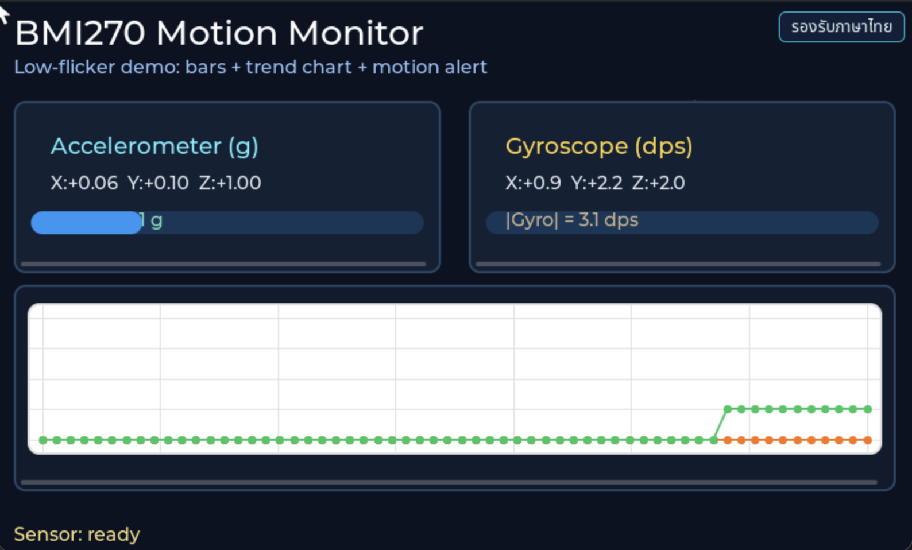

# INT EP02 — BMI270 Motion Visualization

แสดงค่าการเคลื่อนไหว 6 แกนจากเซนเซอร์ Bosch **BMI270** (3-axis accel + 3-axis gyro) บนจอ LVGL แบบเรียลไทม์

---

## Screenshot



## Why — ทำไมต้องเรียนตอนนี้

**BMI270** เป็น inertial measurement unit (IMU) 6 แกนจาก Bosch Sensortec ออกแบบมาสำหรับสวมใส่ (wearables) และสมาร์ทโฟน จุดเด่น:

- **Accelerometer** — ช่วง ±2g / ±4g / ±8g / ±16g, ความละเอียด 16-bit
- **Gyroscope** — ช่วง ±125 dps ถึง ±2000 dps
- **Low power** — ใช้ไฟต่ำเพียง ~420 µA ที่ 100 Hz
- **Smart features** — step counter, wrist wear-detection, gesture recognition ฝังในชิป

IMU เป็นเซนเซอร์ฐานของ:

- **Sensor fusion** (รวมกับ magnetometer → orientation)
- **Dead reckoning** (ประมาณตำแหน่งจากการเคลื่อนไหว)
- **Gesture / activity recognition** (ML on edge)
- **Vibration monitoring** (industrial IoT)

ในตอนนี้คุณจะได้เรียนรู้:

1. วิธี bootstrap BMI270 — ต้องโหลด **config file ~8 KB** เข้าชิปก่อนใช้งาน
2. การอ่านค่า 6 แกนพร้อมกัน แล้วปรับ scale ตาม range ที่เลือก
3. การเชื่อม raw data กับ LVGL chart/bar widgets แบบ 60 fps

---

## What — ไฟล์ในตอนนี้

| ไฟล์ | หน้าที่ |
|---|---|
| `main_example.c` | Entry wrapper — เรียก `bmi270_presenter_start()` |
| `app_sensor/bmi270/bmi270_driver.{c,h}` | คุย BMI270 — probe, config upload, regs |
| `app_sensor/bmi270/bmi270_reader.{c,h}` | อ่าน accel/gyro + แปลง scale |
| `app_sensor/bmi270/bmi270_config.h` | ช่วงวัด, ODR, oversampling |
| `app_sensor/bmi270/bmi270_types.h` | struct samples 6 axes |
| `app_ui/bmi270/bmi270_presenter.{c,h}` | ประสาน reader ↔ view |
| `app_ui/bmi270/bmi270_view.{c,h}` | LVGL widgets (bars, labels, chart) |
| `app_ui/app_logo.{c,h}`, `APP_LOGO.png` | โลโก้หัวจอ |

รวม **14 ไฟล์**

---

## How — อ่านโค้ดทีละชั้น

### ชั้นที่ 1 — ใช้ I2C bus จาก master

```c
#include "sensor_bus.h"                /* extern mtb_hal_i2c_t sensor_i2c_controller_hal_obj */
#include "bmi270/bmi270_presenter.h"

void example_main(lv_obj_t *parent)
{
    (void)parent;
    bmi270_presenter_start(&sensor_i2c_controller_hal_obj);
}
```

### ชั้นที่ 2 — Driver bootstrap ที่ไม่ธรรมดา

`bmi270_driver_init()` ทำ sequence พิเศษ:

1. อ่าน CHIP_ID ที่ register `0x00` (ต้องได้ `0x24`)
2. Soft-reset (`CMD=0xB6`) แล้วรอ 2 ms
3. Disable advanced power save
4. **อัปโหลด config file ขนาด ~8 KB** เข้า register `INIT_DATA` ทีละ chunk — นี่คือ firmware ของ BMI270 DSP
5. ตรวจ `INTERNAL_STATUS` ว่าเป็น `0x01` (init ok)
6. เปิด accelerometer + gyroscope, ตั้ง ODR 100 Hz, range ±4g / ±500 dps

> เฉพาะ BMI270 ที่ต้อง upload config — BMI160 / BMI088 ไม่ต้อง

### ชั้นที่ 3 — Reader → Presenter pipeline

ทุก 10 ms (100 Hz):

```
reader task  →  xQueueSend(samples)  →  presenter  →  lv_async_call → view
                                                  ↓
                                           update 6 bars + chart
```

Accel แสดงเป็น `m/s²`, gyro แสดงเป็น `°/s`

### ชั้นที่ 4 — View

`bmi270_view.c` สร้าง 6 LVGL bars (x/y/z ของ accel + gyro) สีแดง/เขียว/น้ำเงิน และ `lv_chart_t` ไว้แสดง trace การเคลื่อนไหว

---

## Install & Run

```bash
cd tesaiot_dev_kit_master
rsync -a ../episodes/int_ep02_bmi270_motion_visual/ proj_cm55/apps/int_ep02_bmi270_motion_visual/
make getlibs
make build -j
make program
```

เขย่าบอร์ดเบาๆ — bars ควรกระโดดตามแรง และ chart ควรวาดคลื่น

---

## Experiment Ideas

- **Tap detection** — ใช้ interrupt pin แทนการ poll
- **Orientation แบบ complementary filter** — รวม accel + gyro เป็น pitch/roll
- **Step counter** — เปิด feature engine ในชิป (BMI270 มี step counter ฝังมาด้วย)
- **Gesture** — เขียน state machine จับ "shake 3 ครั้ง" เพื่อรีเซ็ตจอ

---

## Glossary

- **IMU** — Inertial Measurement Unit
- **g (gravity unit)** — 1 g ≈ 9.81 m/s²
- **dps** — degrees per second (หน่วยของ gyro)
- **ODR** — Output Data Rate
- **FIFO** — buffer ฝังในชิปเก็บตัวอย่างระหว่าง host ยุ่ง

---

## Next

ไปตอน **EP03 — SHT40 Indicator** เรียนเซนเซอร์สิ่งแวดล้อม (ความชื้น + อุณหภูมิ)
