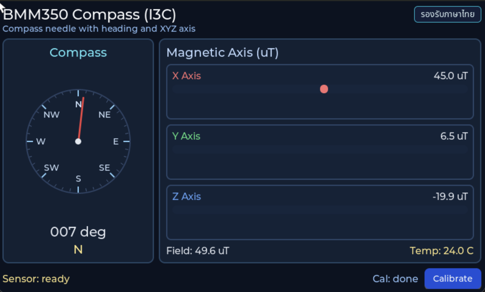

# INT EP04 — BMM350 Magnetometer Compass

สร้าง **เข็มทิศดิจิทัล** จากเซนเซอร์สนามแม่เหล็ก Bosch **BMM350** บน I3C bus พร้อมฟีเจอร์ calibration (hard-iron) แบบโต้ตอบบนหน้าจอ

---

## Screenshot



## Why — ทำไมต้องเรียนตอนนี้

**BMM350** คือ **3-axis magnetometer** รุ่นล่าสุดของ Bosch (2023) เด่นที่:

- **Noise ต่ำมาก** — 1.4 µT RMS (เทียบกับ BMM150 ที่ 2.3 µT)
- **Range** — ±2000 µT (ครอบคลุมสนามโลก ~25-65 µT ได้สบาย)
- **I3C native** — ใช้ bus ใหม่กว่า I2C, มี dynamic addressing, in-band interrupt
- **Built-in compensation** — ชิปมี built-in temperature + cross-axis compensation

Magnetometer ใช้ใน:

- **Digital compass** (smartphone, smartwatch)
- **AR / VR headset** — ใช้ร่วมกับ IMU เป็น 9-DOF fusion
- **Drone yaw stabilization**
- **Indoor positioning** — จับ anomaly ของโลหะในอาคาร
- **Wearables** — tilt-compensated heading

ในตอนนี้คุณจะได้เรียนรู้:

1. ความต่างระหว่าง **I2C และ I3C** — I3C เร็วกว่า, power ต่ำกว่า, มี IBI (in-band interrupt)
2. สูตร **atan2(y, x)** เพื่อคำนวณ heading จากสนามแม่เหล็ก
3. **Hard-iron calibration** — เก็บ min/max ของแต่ละแกนแล้ว offset ออก
4. การจัดการ **I3C controller handle** ของ PSoC Edge ที่ master template ตั้งค่าไว้ให้แล้ว

---

## ⚠️ BMM350 Vendor Code Fix — อ่านก่อนบิลด์

Bosch ส่งไฟล์ `bmm350.c` (ใน COMPONENT_BMM350_I3C overlay) ที่มี **compile error** กับ GCC — ต้องรัน `bmm350_fix.bash` ของ Infineon หนึ่งครั้งก่อนบิลด์

**การแก้ในตอนนี้**: ไม่ได้ vendor ไฟล์ `bmm350.c` ที่แพตช์แล้วไว้ให้ (ยังไม่มี copy ที่แพตช์สำเร็จในเครื่อง) ดังนั้นคุณต้องทำหนึ่งในสองทาง:

**ทาง A (แนะนำ)** — หลัง `make getlibs` ครั้งแรก รัน fix script:
```bash
cd tesaiot_dev_kit_master
make getlibs
bash mtb_shared/sensor-orientation-bmm350/*/COMPONENT_BMM350_I3C/bmm350_fix.bash \
     mtb_shared/BMM350_SensorAPI/*/bmm350.c
make build -j
```

**ทาง B** — ถ้า fix script ดูกลืนบรรทัดสุดท้าย เพิ่ม newline ก่อน:
```bash
printf '\n' >> mtb_shared/BMM350_SensorAPI/*/bmm350.c
bash mtb_shared/sensor-orientation-bmm350/*/COMPONENT_BMM350_I3C/bmm350_fix.bash \
     mtb_shared/BMM350_SensorAPI/*/bmm350.c
```

> เวอร์ชันเก่าของตอนนี้ใช้ prebuild step ใน Makefile เพื่อทำ auto-fix แต่ master template ใหม่ไม่มี prebuild hook ของ episode แล้ว เพื่อให้ contract เรียบ ต้องทำ manual step นี้หนึ่งครั้ง (fix เป็น idempotent — รันซ้ำปลอดภัย)

---

## What — ไฟล์ในตอนนี้

| ไฟล์ | หน้าที่ |
|---|---|
| `main_example.c` | Entry wrapper → `bmm350_presenter_start(HW, ctx)` |
| `app_sensor/bmm350/bmm350_driver.{c,h}` | I3C read/write wrapper รอบ Bosch SensorAPI |
| `app_sensor/bmm350/bmm350_reader.{c,h}` | Poll task ที่อ่าน XYZ เป็น µT |
| `app_sensor/bmm350/bmm350_config.h` | ODR, oversampling, averaging |
| `app_sensor/bmm350/bmm350_types.h` | struct samples + calibration state |
| `app_ui/bmm350/bmm350_presenter.{c,h}` | Coordinator — รับค่า XYZ, คำนวณ heading |
| `app_ui/bmm350/bmm350_view.{c,h}` | Compass dial + needle + cal button |
| `app_ui/app_logo.{c,h}`, `APP_LOGO.png` | โลโก้ |

รวม **14 ไฟล์**

---

## How — อ่านโค้ดทีละชั้น

### ชั้นที่ 1 — I3C bus จาก master

`master/main.c` เรียก `i3c_controller_init()` ก่อน spawn task จอ ซึ่ง export:

```c
/* sensor_bus.h */
extern cy_stc_i3c_context_t CYBSP_I3C_CONTROLLER_context;

/* จาก cybsp.h ที่ generate จาก BSP */
#define CYBSP_I3C_CONTROLLER_HW  I3C0  /* หรือเทียบเท่า */
```

### ชั้นที่ 2 — Entry

```c
#include "sensor_bus.h"
#include "bmm350/bmm350_presenter.h"

void example_main(lv_obj_t *parent)
{
    (void)parent;
    bmm350_presenter_start(CYBSP_I3C_CONTROLLER_HW, &CYBSP_I3C_CONTROLLER_context);
}
```

### ชั้นที่ 3 — Driver uses Bosch SensorAPI

`bmm350_driver.c` ห่อ Bosch vendor API (`bmm350_init`, `bmm350_set_powermode`, `bmm350_get_compensated_mag_xyz_temp_data`) โดย inject I3C read/write callback ที่เรียก `Cy_I3C_ControllerWrite` / `Cy_I3C_ControllerRead` ของ PDL

### ชั้นที่ 4 — Heading calculation

```c
/* หลัง calibration offset */
float bx = raw_x - cal.offset_x;
float by = raw_y - cal.offset_y;

float heading_rad = atan2f(by, bx);
float heading_deg = heading_rad * (180.0f / M_PI);
if (heading_deg < 0.0f) heading_deg += 360.0f;
```

### ชั้นที่ 5 — Hard-iron calibration flow

เมื่อผู้ใช้กดปุ่ม "Calibrate" บนจอ:

1. เริ่มเก็บ min/max ของ X, Y, Z นาน 15 วินาที
2. ผู้ใช้ **หมุนบอร์ดให้ครบทุกทิศทาง** (figure-8)
3. หลังจบคำนวณ:
   ```
   offset_x = (max_x + min_x) / 2
   offset_y = (max_y + min_y) / 2
   offset_z = (max_z + min_z) / 2
   ```
4. เก็บ offset ลง RAM, ใช้ตลอด session

> Soft-iron calibration (สเกลบิดเบี้ยว) จะไม่ทำในตอนนี้ — ต้อง fit ellipsoid ซึ่งซับซ้อน

### ชั้นที่ 6 — View

`bmm350_view.c` วาด:

- **Dial** 360° ด้วย `lv_arc`
- **Needle** หมุนด้วย `lv_img_set_angle`
- **Heading label** (`N 12°`, `E 87°`, …)
- **Cal progress bar** เมื่อกำลัง calibrate

---

## Install & Run

> ⚠️ **สำคัญ — ต้อง apply BMM350 patch ก่อน build ครั้งแรก** (ดู section [Troubleshooting](#troubleshooting) ด้านล่าง)

```sh
cd tesaiot_dev_kit_master

# เคลียร์ episode เก่า
find proj_cm55/apps -mindepth 1 -maxdepth 1 \
     ! -name 'app_interface.h' ! -name 'README.md' ! -name '_default' \
     -exec rm -rf {} +

# วาง episode ลง apps/
rsync -a ../episodes/int_ep04_bmm350_compass/ proj_cm55/apps/

# Build + flash
make build
make program
```

หมุนบอร์ด — เข็มทิศควรชี้ตาม north ที่จริง (ประมาณ ±5° เทียบกับเข็มทิศของมือถือ)

---

## ⚠️ Troubleshooting

### อาการ: จอดำ / ค้าง ตอน boot

**Symptom:** เปิดบอร์ดแล้วเห็น serial log
```
****************** TESAIoT Dev Kit Master — Ready for Episode ******************
```
แต่หน้าจอดำ ไม่มี compass dial ขึ้นมาเลย

**สาเหตุ — Upstream bug ใน BMM350 SensorAPI**:

Bosch BMM350 SensorAPI (`mtb_shared/BMM350_SensorAPI/v1.10.0/bmm350.c`) มี bug
ที่รู้จักแล้ว (ดูที่ [GitHub Issue](https://github.com/boschsensortec/BMM350_SensorAPI/blob/main/bmm350.c#L219)):

ใน `bmm350_init()` มีบรรทัด `soft_reset = BMM350_CMD_SOFTRESET;` ซึ่งเมื่อใช้ I3C interface:

1. driver ส่ง soft reset ไปที่ sensor
2. BMM350 ถูก reset กลับไป I2C mode (ค่า default factory)
3. driver พยายามคุยต่อผ่าน I3C → ไม่เจอ sensor → block รอ response ไม่มีวันจบ
4. ผลคือ `bmm350_init()` ไม่ return → `bmm350_presenter_start()` ไม่ return
5. LVGL event loop ไม่ได้ run → หน้าจอไม่ได้ update → **จอดำค้าง**

**Fix — Apply patch script หรือ sed command**:

**วิธีที่ 1 (แนะนำ — sed แบบ atomic):**

```sh
sed -i '' '254s|            soft_reset = BMM350_CMD_SOFTRESET;|            // soft_reset = BMM350_CMD_SOFTRESET; /* patched per bmm350_fix.bash (I3C softreset bug) */|' \
    mtb_shared/BMM350_SensorAPI/v1.10.0/bmm350.c

# บังคับ rebuild bmm350 object
rm -rf tesaiot_dev_kit_master/proj_cm55/build/Debug/libraries_shared/BMM350_SensorAPI/

# build ใหม่
cd tesaiot_dev_kit_master && make build
```

**วิธีที่ 2 (ใช้ bash script ต้นฉบับ):**

```sh
bash mtb_shared/sensor-orientation-bmm350/release-v1.0.1/COMPONENT_BMM350_I3C/bmm350_fix.bash \
     mtb_shared/BMM350_SensorAPI/v1.10.0/bmm350.c
```

> **คำเตือน:** bash script ต้นฉบับใช้ `printf -v` ซึ่งต้องการ **bash 4+** บน macOS ที่มี bash 3.2 เป็น default อาจทำให้ไฟล์เสีย (`unterminated #ifdef` ขณะ compile) ควรเช็คด้วย `wc -l` ว่าไฟล์ยังมี 2195 บรรทัดเท่าเดิม ถ้าไม่ให้ re-fetch pristine:
> ```sh
> rm -rf mtb_shared/BMM350_SensorAPI && cd tesaiot_dev_kit_master && make getlibs
> ```
> แล้วใช้วิธีที่ 1 (sed) แทน

**ตรวจสอบว่า patch สำเร็จ:**

```sh
grep -n "soft_reset = BMM350_CMD_SOFTRESET" mtb_shared/BMM350_SensorAPI/v1.10.0/bmm350.c
# ต้องเห็น:    254:            // soft_reset = BMM350_CMD_SOFTRESET; ...
```

### ทำไม Master Template ไม่ apply patch อัตโนมัติ

ต้นฉบับ interactive-examples ep04/ep07 ใช้ `PREBUILD=bash ./tools/bmm350_fix_wrapper.bash ...`
ใน Makefile แต่ Master Template ของ TESAIoT Foundation **จงใจลบ `PREBUILD=` ออก**
เพื่อ:

1. **Windows-safe** — Windows ไม่มี bash native (ต้อง WSL หรือ Git Bash)
2. **Reproducible builds** — prebuild bash ทำให้ build ไม่ deterministic (ถ้ามีคน `make getlibs`
   ใหม่หลัง patch, patch จะถูกลบออก)

เลือกให้ developer apply patch ครั้งเดียวด้วยตัวเอง (หรือด้วย wrapper tool) ดีกว่า
ลงโทษ build system ให้ต้องพึ่ง bash ตลอด

### การกลับไปยังสถานะ pristine

ถ้าต้องการกลับไปสถานะก่อน patch (เช่น upgrade SensorAPI):

```sh
rm -rf mtb_shared/BMM350_SensorAPI
cd tesaiot_dev_kit_master && make getlibs
# จะได้ bmm350.c pristine กลับมา (จะ break I3C อีกครั้ง ต้อง re-apply patch)
```

### เช็ค serial log ขณะ debug

```sh
screen /dev/cu.usbmodem1103 115200
```

**Healthy boot sequence ของ ep04:**
```
****************** TESAIoT Dev Kit Master — Ready for Episode ******************
[MASTER] Sensor I2C init OK
[MASTER] I3C init OK
[BMM350] INIT_OK chip_id=0x33
[BMM350] raw X=... Y=... Z=... uT
[BMM350] heading=... deg
```

**Broken sequence (ก่อน patch):**
```
****************** TESAIoT Dev Kit Master — Ready for Episode ******************
[MASTER] Sensor I2C init OK
[MASTER] I3C init OK
# จบตรงนี้ — ไม่มี [BMM350] INIT_OK ออกมาเลย = block อยู่ใน bmm350_init()
```

---

## Experiment Ideas

- **Tilt compensation** — รวมกับ BMI270 accel เพื่อให้เข็มทิศยัง work ถ้าบอร์ดเอียง
- **Magnetic anomaly mapping** — เดินรอบโต๊ะ log heading ต่อจุด เช็คโลหะที่ซ่อน
- **3D magnetic field viewer** — วาด vector 3D บนจอ
- **Auto-cal hints** — ตรวจว่า figure-8 ครบทุกทิศก่อนจะ accept calibration

---

## Glossary

- **I3C** — Improved Inter-Integrated Circuit, เร็วกว่า I2C ~12 เท่า, มี dynamic address + IBI
- **Hard-iron** — DC offset จากแม่เหล็กติดตัวบอร์ด (จัมเปอร์, เคส)
- **Soft-iron** — distortion แบบสเกลเอียงจากเหล็กใกล้ๆ
- **Heading** — มุมระหว่างทิศที่บอร์ดชี้ กับทิศเหนือแม่เหล็ก
- **Declination** — ต่างระหว่าง magnetic north กับ true north (เปลี่ยนตามพิกัด)

---

## Next

ไปตอน **EP05 — BMI270 Radar View** ต่อยอด IMU ให้กลายเป็น motion radar polar plot
