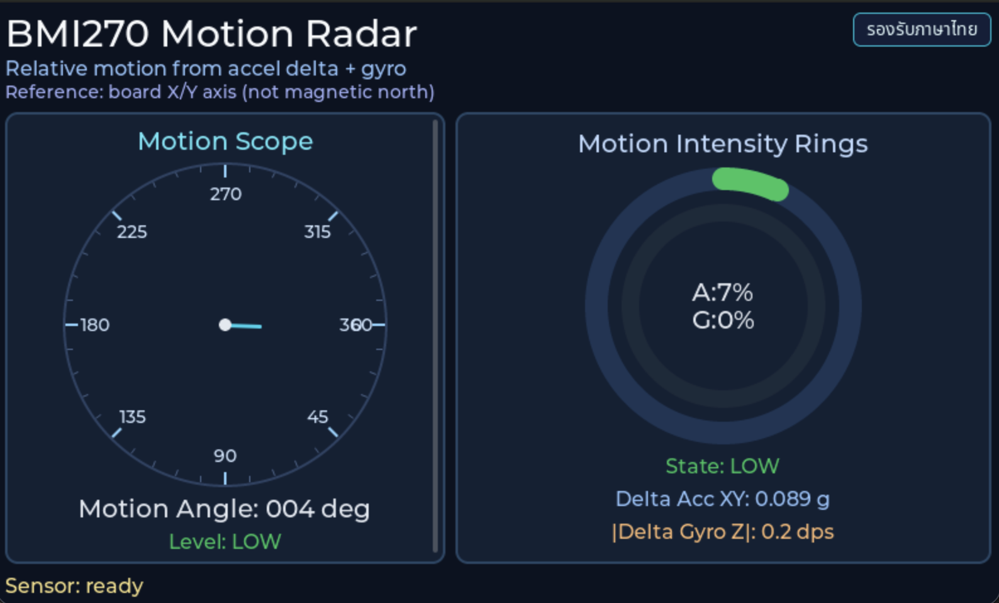

# INT EP05 — BMI270 Radar View

นำข้อมูล 6 แกนของ BMI270 มา **โปรเจกต์เป็น polar plot** เป็น motion radar แบบเรดาร์จริง — เห็นทิศทางการเคลื่อนไหวในพริบตาเดียว

---

## Screenshot



## Why — ทำไมต้องเรียนตอนนี้

ตอนที่ 2 เราแสดง IMU เป็น bar 6 แท่ง — ตรงไปตรงมาแต่ **อ่านยาก** เพราะต้องเปรียบเทียบ 3 แกนพร้อมกัน

ตอนนี้เราเปลี่ยนแนวคิด: **ยุบสามแกนของ accel เป็น vector เดียว** แล้ววาดเป็นจุด/เส้นบน polar plot (เหมือน radar screen) ผลคือ:

- **Direction at a glance** — เห็นทิศของแรงทันที
- **Magnitude as radius** — เห็นความแรง
- **Trace history** — เก็บ 64 จุดล่าสุด ทำให้เห็น "ลาย" ของการเคลื่อนไหว
- **Visual intuition** — ช่วยให้คนเข้าใจ 3D motion บนจอ 2D

ใช้ต่อได้ในหลายงาน:

- **Robotics** — แสดง force vector ของ actuator
- **Motion capture** — visualize gesture
- **Biomechanics** — วาด gait cycle ของคนเดิน
- **Accessibility** — แสดง head tilt ของคนพิการ

---

## What — ไฟล์ในตอนนี้

| ไฟล์ | หน้าที่ |
|---|---|
| `main_example.c` | Entry wrapper → `radar_presenter_start()` |
| `app_sensor/bmi270/…` | Driver + reader (เหมือน ep02) |
| `app_ui/radar/radar_presenter.{c,h}` | Coordinator: ดึง sample → คำนวณ polar → push view |
| `app_ui/radar/radar_view.{c,h}` | LVGL canvas + rings + dot + trace line |

รวม **11 ไฟล์** (ไม่มีโลโก้ในตอนนี้ เพื่อให้ radar เต็มจอ)

---

## How — อ่านโค้ดทีละชั้น

### ชั้นที่ 1 — Entry

```c
#include "sensor_bus.h"
#include "radar/radar_presenter.h"

void example_main(lv_obj_t *parent)
{
    (void)parent;
    radar_presenter_start(&sensor_i2c_controller_hal_obj);
}
```

### ชั้นที่ 2 — Cartesian → Polar

```c
/* จาก accel x/y/z ในหน่วย m/s² */
float magnitude = sqrtf(ax*ax + ay*ay + az*az);
float angle_rad = atan2f(ay, ax);         /* หมุนรอบแกน Z */

float radius_px = magnitude * RADAR_SCALE;
int   px        = cx + radius_px * cosf(angle_rad);
int   py        = cy + radius_px * sinf(angle_rad);
```

### ชั้นที่ 3 — Ring grid

`radar_view.c` วาด concentric circles 4 วง (ที่ 25%, 50%, 75%, 100% ของ full-scale) และเส้นแนว cardinal (N/E/S/W)

### ชั้นที่ 4 — Trace buffer

```c
typedef struct {
    lv_point_t pts[RADAR_TRACE_LEN];  /* ~64 จุด */
    uint16_t   head;
} radar_trace_t;
```

ทุก frame push `pts[head++]` (circular) แล้ว `lv_canvas_draw_line()` ต่อจุดเป็นเส้น — **fade older** โดยลด alpha ตามอายุ

### ชั้นที่ 5 — Gyro overlay

ส่วน gyro (°/s) วาดเป็น arc ที่มุมตามแกน z พร้อมความยาวตามความเร็ว — ทำให้เห็นการหมุนควบคู่

---

## Install & Run

```bash
cd tesaiot_dev_kit_master
rsync -a ../episodes/int_ep05_bmi270_radar_view/ proj_cm55/apps/int_ep05_bmi270_radar_view/
make getlibs      # เฉพาะครั้งแรก
make build -j
make program
```

เอียงบอร์ดทางซ้าย — dot ควรเลื่อนไปซ้าย; เขย่ารอบ z — เห็น trace หมุนรอบจุดกลาง

---

## Experiment Ideas

- **High-pass filter** — ลบ gravity ออก จะเห็นเฉพาะ dynamic motion
- **Persistence mode** — ไม่ clear trace → วาด "ร่องรอย" การเคลื่อนไหวตลอดเซสชัน
- **Dual radar** — หนึ่งวงสำหรับ accel อีกวงสำหรับ gyro
- **Sound feedback** — เล่น tone ตาม radius (ใช้ PDM ไม่ได้ เพราะเป็น input อย่างเดียว — ใช้ LED แทน)

---

## Glossary

- **Polar plot** — plane ที่แทนจุดด้วย (radius, angle) แทน (x, y)
- **Cartesian** — ระบบพิกัด x/y ปกติ
- **Magnitude** — ขนาดของ vector = `√(x² + y² + z²)`
- **atan2** — arctangent 2-arg คืนมุม full ±π แทน ±π/2 ของ `atan`

---

## Next

ไปตอน **EP06 — Digital Mic Probe** เปลี่ยนจาก motion → audio capture ผ่าน PDM
