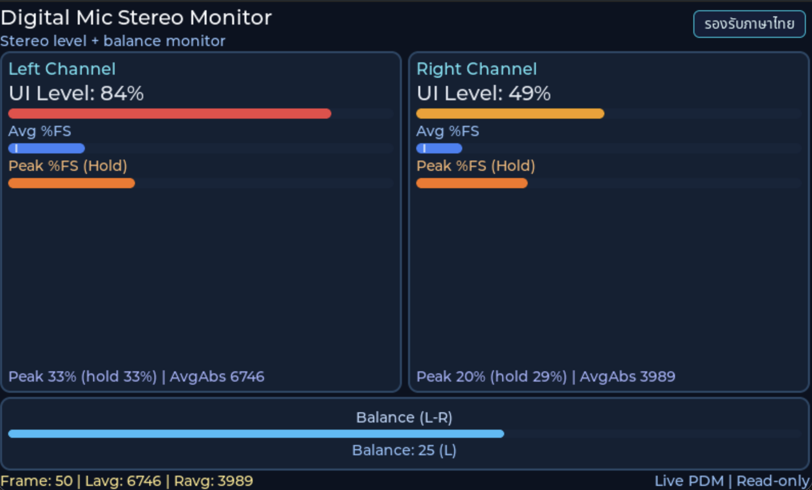

# INT EP06 — Digital Microphone Probe (PDM)

จับสัญญาณเสียงจาก **ไมโครโฟน PDM สเตอริโอ** บนบอร์ด TESAIoT Dev Kit คำนวณระดับความดังซ้าย/ขวา แล้วแสดงเป็น **stereo level meter** บนจอ LVGL

---

## Screenshot



## Why — ทำไมต้องเรียนตอนนี้

บอร์ด PSoC Edge มี peripheral ชื่อ **PDM/PCM converter** — ของจริงของมันคือ:

- **Input**: ไบสตรีมความเร็วสูง (1 – 3 MHz) ของ **1-bit PDM samples** จากไมค์ MEMS
- **Output**: **multi-bit PCM samples** ที่ lowpass + decimate ด้วย CIC filter
- **DMA-driven** — CPU ไม่ต้องยุ่ง, hardware เขียนลง circular buffer

เข้าใจเรื่องนี้สำคัญเพราะ:

- **ML on edge** ต้อง 16 kHz mono PCM → feature extraction → NN inference
- **Keyword spotting** (ห้องเปิดไฟด้วยเสียง)
- **Sound level monitoring** (noise survey ในโรงงาน)
- **Beamforming / DOA** — ใช้สองไมค์หาทิศทางของเสียง
- **Acoustic event detection** — แจ้งเตือนเสียงกระจกแตก

### PDM vs PCM

| | PDM | PCM |
|---|---|---|
| sample width | 1 bit | 16 / 24 bit |
| sample rate | 1 – 3 MHz | 8 – 48 kHz |
| meaning | density = amplitude | direct quantization |
| wire | 1 data + 1 clock | I²S หรือ TDM |
| MEMS mic output | **PDM** | ต้อง codec เพิ่ม |

PDM ชนะเพราะไมค์ MEMS ขนาดเล็กส่ง PDM ออกมาได้โดยตรง ชิป PSoC จะแปลงเป็น PCM ให้เอง

---

## What — ไฟล์ในตอนนี้

| ไฟล์ | หน้าที่ |
|---|---|
| `main_example.c` | Entry wrapper: start UI + PDM logger |
| `app_audio/pdm/pdm_mic.{c,h}` | ตั้งค่า PDM/PCM controller, DMA, circular buffer |
| `app_audio/pdm/pdm_probe_logger.{c,h}` | Task ที่ compute peak/avg ซ้าย-ขวา แล้ว push ไปยัง UI |
| `app_ui/mic/mic_presenter.{c,h}` | Consumer ของ sample snapshot + publisher ให้ view |
| `app_ui/mic/mic_view.{c,h}` | Stereo level bar + peak-hold indicator |

รวม **9 ไฟล์**

---

## How — อ่านโค้ดทีละชั้น

### ชั้นที่ 1 — Entry wrapper

```c
#include "mic/mic_presenter.h"
#include "pdm/pdm_probe_logger.h"

void example_main(lv_obj_t *parent)
{
    (void)parent;

    (void)mic_presenter_start();      /* สร้าง UI ก่อน */
    (void)pdm_probe_logger_start();   /* ค่อย spawn producer */
}
```

> ลำดับสำคัญ — producer ต้องหา consumer ที่สร้าง LVGL object ไว้แล้ว ไม่งั้นจะ `lv_async_call` ใส่ NULL

### ชั้นที่ 2 — PDM controller config

`pdm_mic_init()`:

1. ตั้ง PDM clock divider ให้ได้ ~3.072 MHz (16 kHz × 192 decimation)
2. กำหนด channel = stereo (L + R)
3. กำหนด DMA descriptor ชี้ไปที่ **ping-pong buffer** (สอง half บน SRAM)
4. เปิด interrupt ที่ half-transfer + transfer-complete
5. ผูก DMA channel → IRQ handler ที่ `xTaskNotifyFromISR` กระตุ้น task

ผลคือ CPU ได้ทำงานเป็น block-by-block (เช่น 256 samples × 2 ch) แทนการ poll sample ทีละตัว

### ชั้นที่ 3 — Level computation

`pdm_probe_logger_task`:

```c
for each block:
    int32_t l_peak = 0, r_peak = 0;
    int64_t l_sum  = 0, r_sum  = 0;
    for (i = 0; i < N; i += 2) {
        int16_t l = abs(buf[i]);
        int16_t r = abs(buf[i+1]);
        l_peak = max(l_peak, l);
        r_peak = max(r_peak, r);
        l_sum += l;
        r_sum += r;
    }
    sample.left_peak_abs  = l_peak;
    sample.right_peak_abs = r_peak;
    sample.left_avg_abs   = l_sum / (N/2);
    sample.right_avg_abs  = r_sum / (N/2);
    /* แปลงเป็น % of full-scale */
    sample.left_ui_pct    = (l_peak * 100) / INT16_MAX;
    sample.right_ui_pct   = (r_peak * 100) / INT16_MAX;

    mic_presenter_publish_sample(&sample);
```

### ชั้นที่ 4 — UI update

`mic_presenter.c` เก็บ sample ใน `volatile` struct แล้ว `lv_async_call` ในจังหวะ 50 Hz เพื่อ `lv_bar_set_value()` — ไม่ update ทุก block (ซ้ำเกินตาเห็น)

### ชั้นที่ 5 — Peak-hold bar

`mic_view.c` มี **two-layer bar**:

- **Active** — สีเขียว กระโดดตาม peak ทันที
- **Hold** — เส้นเล็กๆ ค้างอยู่สูงสุด 1 วินาทีแล้วค่อย decay ลง

---

## Install & Run

```bash
cd tesaiot_dev_kit_master
rsync -a ../episodes/int_ep06_digital_mic_probe/ proj_cm55/apps/int_ep06_digital_mic_probe/
make getlibs
make build -j
make program
```

พูดใกล้ไมค์ซ้าย — bar ซ้ายควรขึ้นสูงกว่าขวา
เคาะนิ้วใกล้ไมค์ขวา — bar ขวาควรกระโดด

---

## Experiment Ideas

- **Clap detect** — ถ้า peak > 80 % ภายใน 50 ms → toggle LED
- **Balance meter** — แสดง `(L - R) / (L + R)` เป็นเข็ม bar กลางจอ
- **FFT** — รัน 256-point FFT แล้ววาด spectrum (CMSIS-DSP)
- **RMS dBFS** — แปลงเป็น `20*log10(rms/32768)` เพื่ออ่านเป็น dB
- **Record to ring buffer** — เก็บ 1 วินาทีล่าสุด dump ผ่าน UART

---

## Glossary

- **PDM** — Pulse Density Modulation, 1-bit high-rate stream
- **PCM** — Pulse Code Modulation, multi-bit low-rate samples
- **Decimation** — ลด sample rate ด้วย lowpass + downsample
- **CIC filter** — Cascaded Integrator-Comb, ตัวกรองที่ใช้ใน PDM-to-PCM
- **Full scale** — amplitude สูงสุดที่ container เก็บได้ (±32767 สำหรับ int16)
- **dBFS** — dB Full Scale, 0 dBFS = full-scale, -inf = silence
- **Ping-pong buffer** — สอง half-buffer ที่สลับ producer/consumer

---

## Next

ไปตอน **EP07 — SensorHub Final** — เป็น course finale ที่รวมทุกอย่าง (4 sensors + mic) ในจอเดียว
