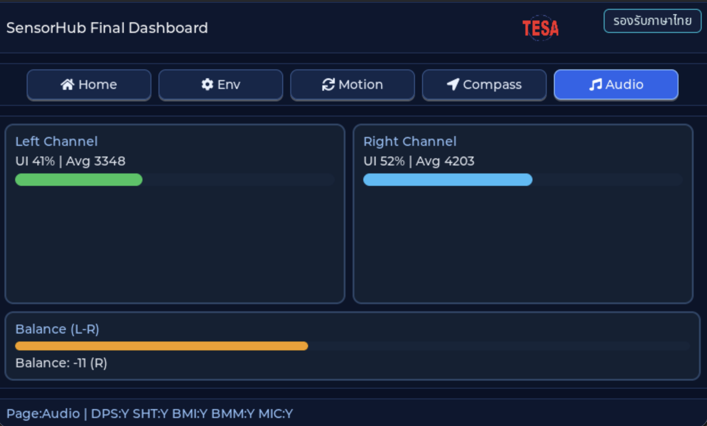

# INT EP07 — SensorHub Final

**บทปิดคอร์ส Interactive** — แดชบอร์ดรวมเซนเซอร์ทั้งหมดบนบอร์ด TESAIoT Dev Kit บนจอเดียว:

- **DPS368** — ความดัน / อุณหภูมิ (I2C)
- **SHT4x** — ความชื้น / อุณหภูมิ (I2C)
- **BMI270** — 6-axis IMU (I2C)
- **BMM350** — 3-axis magnetometer (I3C)
- **PDM stereo microphone** — audio level meter

---

## Screenshot



## Why — ทำไมต้องเรียนตอนนี้

ตอนที่ 1 – 6 สอน subsystem ทีละชิ้น ตอนนี้ (ตอนจบ) เรารวมทุกชิ้นเป็น **ระบบเดียวที่ทำงานพร้อมกัน** ซึ่งคือสถานการณ์ของจริงในโลกผลิตภัณฑ์:

- **IoT Gateway** — multi-sensor + cloud (ลดให้เป็น on-device แดชบอร์ด)
- **Environmental logger** — สำหรับงานวิจัย, การบำรุงรักษาเครื่องจักร
- **Wearable hub** — health + activity + ambient
- **Home automation** — smart thermostat, indoor air quality monitor

สิ่งที่ยากไม่ใช่การอ่านเซนเซอร์แต่ละตัว — ตอน 1-6 สอนไปแล้ว แต่คือ:

1. **จัดคิวและ priority** ของหลาย FreeRTOS task ให้ไม่ starve กัน
2. **ประหยัด I2C bus** ไม่ให้ bandwidth จมเมื่อทุก sensor แย่ง poll
3. **UI responsiveness** — LVGL ต้อง 60 fps ขณะที่ 5 producer กำลังยิงค่าเข้า
4. **Two bus types พร้อมกัน** — I2C (sensors) + I3C (BMM350) + PDM (mic)
5. **Screen management** — ไม่สามารถโชว์ทุกอย่างพร้อมกันในจอเดียว → tab / view switcher

ตอนนี้คุณจะได้เห็นโค้ดที่แก้ปัญหาจริงของ multi-subsystem firmware

---

## ⚠️ BMM350 Vendor Code Fix

เหมือน EP04 — ต้องแพตช์ `bmm350.c` ของ Bosch หลัง `make getlibs` ครั้งแรก ใช้ `bmm350_fix.bash` ของ Infineon (ดูรายละเอียดใน `episodes/int_ep04_bmm350_compass/README.md`) **การแก้เป็น idempotent** — ถ้าเคยทำใน ep04 แล้ว รันใน ep07 ก็ยังปลอดภัย

```bash
cd tesaiot_dev_kit_master
make getlibs
printf '\n' >> mtb_shared/BMM350_SensorAPI/*/bmm350.c 2>/dev/null || true
bash mtb_shared/sensor-orientation-bmm350/*/COMPONENT_BMM350_I3C/bmm350_fix.bash \
     mtb_shared/BMM350_SensorAPI/*/bmm350.c
```

> Prebuild hook ของ episode ถูกลบไปแล้วเพื่อให้ contract `apps/*` เรียบง่าย — fix นี้ต้องทำ manual ครั้งเดียวต่อ workspace

---

## What — ไฟล์ในตอนนี้

ตอนนี้ **ใหญ่ที่สุดในซีรีส์ Interactive** — ~40 ไฟล์

### Sensors (reuse จาก ep01 – ep04)

| Path | หน้าที่ |
|---|---|
| `app_sensor/dps368/` | Driver + reader + types (6 ไฟล์) |
| `app_sensor/sht4x/` | Driver + reader + types (6 ไฟล์) |
| `app_sensor/bmi270/` | Driver + reader + types (6 ไฟล์) |
| `app_sensor/bmm350/` | Driver + reader + types (6 ไฟล์) |

### Audio (reuse จาก ep06)

| Path | หน้าที่ |
|---|---|
| `app_audio/pdm/pdm_mic.{c,h}` | PDM controller + DMA |
| `app_audio/pdm/pdm_probe_logger.{c,h}` | Level compute task |

### UI — ใหม่สำหรับตอนนี้

| Path | หน้าที่ |
|---|---|
| `app_ui/sensorhub/sensorhub_presenter.{c,h}` | **Orchestrator** — สร้างทุก reader, pipe ไปที่ view เดียว |
| `app_ui/sensorhub/sensorhub_view.{c,h}` | **Multi-tile dashboard** LVGL |
| `app_ui/mic/mic_presenter.{c,h}` | Reuse จาก ep06 |
| `app_ui/mic/mic_view.{c,h}` | Reuse จาก ep06 |
| `app_ui/assets/app_logo.{c,h}`, `APP_LOGO.png` | โลโก้ร่วม |

### Entry

`main_example.c` — start ทั้ง sensorhub + mic probe

---

## How — อ่านโค้ดทีละชั้น

### ชั้นที่ 1 — Master bus setup

`tesaiot_dev_kit_master/proj_cm55/main.c` เรียก (ก่อน LVGL task):

- `sensor_i2c_controller_init()` — เปิด SCB0 + HAL wrapper
- `i3c_controller_init()` — เปิด I3C controller + context

ทั้งคู่ export ผ่าน `sensor_bus.h` — episode แค่ `#include`

### ชั้นที่ 2 — Entry wrapper

```c
#include "sensor_bus.h"
#include "sensorhub/sensorhub_presenter.h"
#include "pdm/pdm_probe_logger.h"

void example_main(lv_obj_t *parent)
{
    (void)parent;

    (void)sensorhub_presenter_start(&sensor_i2c_controller_hal_obj,
                                    CYBSP_I3C_CONTROLLER_HW,
                                    &CYBSP_I3C_CONTROLLER_context);

    (void)pdm_probe_logger_start();
}
```

> sensorhub รับทั้ง I2C handle **และ** I3C handle เพราะต้องเปิดทั้ง BMI270 / DPS368 / SHT4x (I2C) + BMM350 (I3C) พร้อมกัน

### ชั้นที่ 3 — Multi-task orchestration

`sensorhub_presenter_start` สร้าง 4 reader task (ละ 2 KB stack) priority เท่ากัน (`tskIDLE_PRIORITY + 2`) แต่ละตัวมี **poll interval ของตัวเอง**:

| Sensor | Interval | Reason |
|---|---|---|
| DPS368 | 200 ms | ความดันเปลี่ยนช้า |
| SHT4x | 500 ms | humidity ต้อง warm-up |
| BMI270 | 20 ms | motion ต้อง smooth |
| BMM350 | 50 ms | compass ต้องไว |

ผลลัพธ์ I2C bus ยุ่งเฉลี่ย < 20 % — ยังมีเวลาให้ mic probe ไม่สะดุด

### ชั้นที่ 4 — Single queue, many producers

ทุก reader push ลง **single message queue** ของ presenter ด้วย union-tagged message:

```c
typedef struct {
    enum { MSG_DPS, MSG_SHT, MSG_BMI, MSG_BMM } tag;
    union {
        dps368_sample_t dps;
        sht4x_sample_t  sht;
        bmi270_sample_t bmi;
        bmm350_sample_t bmm;
    } u;
} sh_msg_t;
```

Consumer task `xQueueReceive()` แล้ว dispatch ไปที่ handler ตามชนิด → อัพเดต LVGL widget ที่เกี่ยวข้องผ่าน `lv_async_call`

### ชั้นที่ 5 — View tiles

`sensorhub_view.c` แบ่งจอเป็น **grid 2×2 + บาร์ด้านล่าง**:

```
┌────────────┬────────────┐
│ DPS368     │ SHT4x      │
│ hPa / °C   │ RH % / °C  │
├────────────┼────────────┤
│ BMI270     │ BMM350     │
│ 6-axis bar │ compass    │
├────────────┴────────────┤
│ Mic L / Mic R level     │
└─────────────────────────┘
```

แต่ละ tile ใช้ `lv_obj` + `lv_label` หรือ `lv_arc`/`lv_bar` — update แยกกันเพื่อไม่ต้อง redraw ทั้งหน้า

### ชั้นที่ 6 — LVGL ไม่ thread-safe

สำคัญมาก: **ไม่มี reader ใดเรียก LVGL API โดยตรง** ทุกอย่างต้องผ่าน `lv_async_call(handler, data)` ที่ push เข้า LVGL main thread อย่างปลอดภัย

---

## Install & Run

```bash
cd tesaiot_dev_kit_master
rsync -a ../episodes/int_ep07_sensorhub_final/ proj_cm55/apps/int_ep07_sensorhub_final/
make getlibs
# (apply BMM350 fix — see above)
make build -j
make program
```

จอควรแสดง 4 tiles + bar ด้านล่าง — ลอง:

1. หายใจรดบอร์ด → RH tile ขึ้น
2. เขย่าบอร์ด → BMI270 bar วิ่ง
3. หมุนบอร์ด → compass needle หมุน
4. พูดใส่ไมค์ → mic bar กระโดด

ทั้งหมดพร้อมกันโดยจอไม่กระตุก

---

## Experiment Ideas

- **Cloud upload** — รวม WiFi ที่เรียนใน HMI ep06 ส่ง JSON ทุก 10 วิ
- **Data log to flash** — เขียน circular log ลง internal flash แล้ว export
- **Edge ML** — รัน keyword spotting บน mic stream + บันทึก trigger ลงไฟล์พร้อม snapshot ของเซนเซอร์
- **Alerting** — ถ้า RH > 85 % และ temp > 35 °C → blink LED แดง
- **Orientation fusion** — รวม BMI270 + BMM350 เป็น 9-DOF quaternion

---

## Glossary

- **Orchestrator** — task ที่ประสานหลาย producer ให้ทำงานร่วมกัน
- **Bus arbitration** — การแบ่งเวลาใช้ bus ระหว่าง master-initiated transfers
- **Queue (FreeRTOS)** — SPSC/MPSC primitive สำหรับส่งข้อมูลระหว่าง task
- **Priority inversion** — task high priority ต้องรอ task low ที่ถือ resource
- **`lv_async_call`** — LVGL primitive สำหรับ marshall call ข้าม thread

---

## End of Interactive Series

ยินดีด้วย! คุณจบคอร์ส Interactive ทั้ง 7 ตอนแล้ว

ตอนนี้คุณรู้:

- วิธีอ่านเซนเซอร์ I2C / I3C / PDM ของจริง
- การจัดการ multi-task + multi-bus บน FreeRTOS
- LVGL threading model + async pattern
- การออกแบบ driver → reader → presenter → view layering
- การ debug sensor firmware ด้วย peek buffer + UART log

**ถัดไป**: ลุยซีรีส์ **HMI (Human-Machine Interface)** เพื่อเรียน touch, menus, screens, WiFi, MQTT, และ cloud ต่อ
